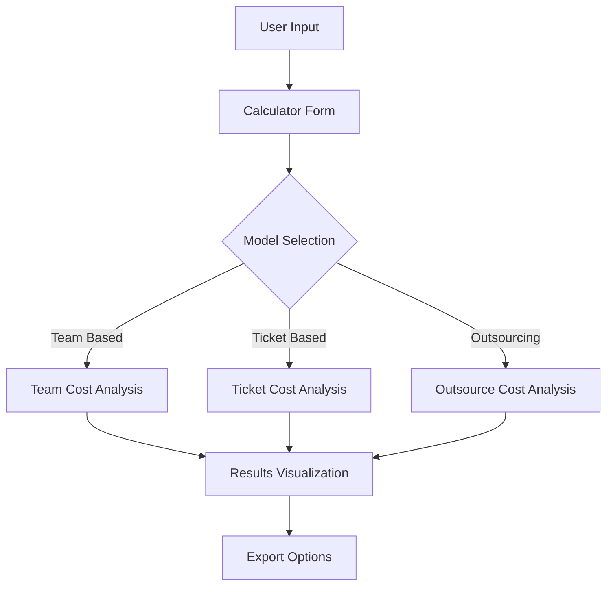
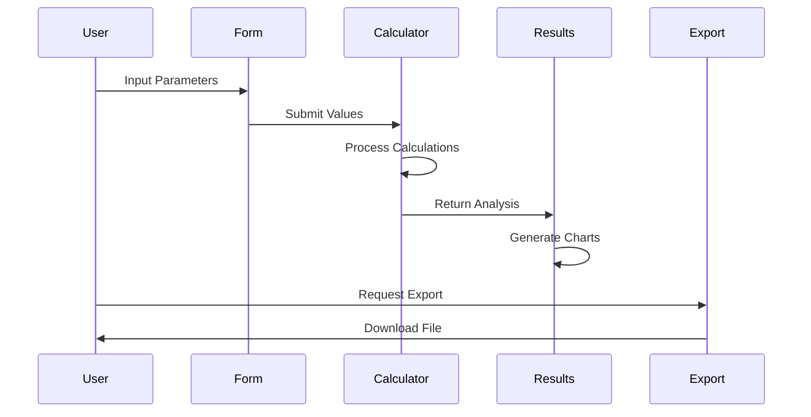
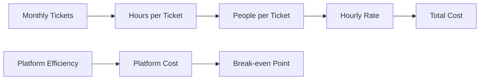
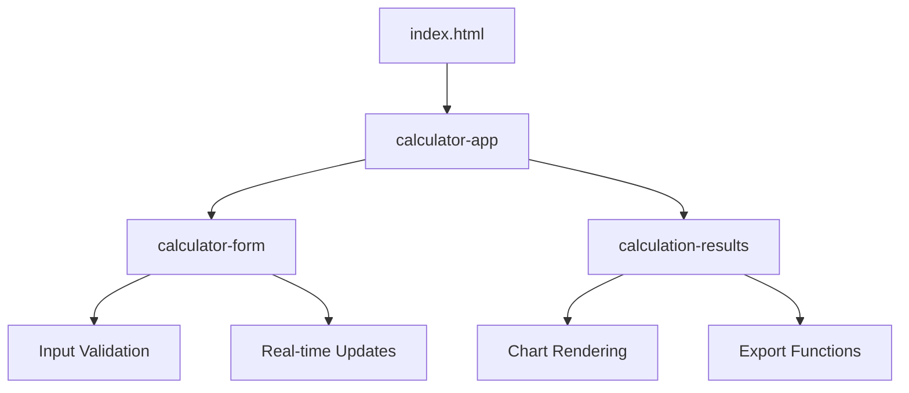

# Service Platform Investment Calculator Documentation

## Table of Contents
- [Service Platform Investment Calculator Documentation](#service-platform-investment-calculator-documentation)
  - [Table of Contents](#table-of-contents)
  - [Overview](#overview)
  - [Architecture](#architecture)
    - [Technology Stack](#technology-stack)
    - [Data Flow](#data-flow)
  - [Cost Models](#cost-models)
    - [Team-Based Model](#team-based-model)
    - [Ticket-Based Model](#ticket-based-model)
    - [Outsourcing Model](#outsourcing-model)
  - [Features](#features)
    - [1. Interactive Calculator](#1-interactive-calculator)
    - [2. Visualization](#2-visualization)
    - [3. Export Capabilities](#3-export-capabilities)
  - [Implementation Details](#implementation-details)
    - [Component Architecture](#component-architecture)
    - [State Management](#state-management)
    - [Event Handling](#event-handling)

## Overview

The Service Platform Investment Calculator is a web application designed to  make data-driven decisions about service delivery strategies. It provides three distinct calculation models:
- Team-Based Analysis
- Ticket-Based Analysis
- Outsourcing Analysis



## Architecture

### Technology Stack

| Component | Technology | Justification |
|-----------|------------|---------------|
| Core Framework | Lit | Lightweight, high performance, web components |
| Styling | Tailwind CSS | Utility-first, zero runtime CSS |
| Charting | Chart.js | Lightweight, responsive charts |
| PDF Export | jsPDF | Client-side PDF generation |
| Excel Export | SheetJS | Comprehensive spreadsheet support |
| Tooltips | Tippy.js | Lightweight, accessible tooltips |


### Data Flow



## Cost Models

### Team-Based Model

The team-based model calculates costs based on the following formula:

```
Monthly Cost = Team Size × Hourly Rate × Working Hours × Service Delivery %
Platform Monthly Cost = (Current Cost × (1 - Efficiency Gain %)) + Maintenance Cost
Break-even Months = Platform Cost ÷ Monthly Savings
```

| Parameter | Description | Range |
|-----------|-------------|--------|
| Team Size | Number of FTEs | 1-1000 |
| Hourly Rate | Cost per hour | $1-1000 |
| Service Delivery % | Time spent on service | 0-100% |
| Platform Cost | Development cost | $0-10M |
| Maintenance Cost | Monthly upkeep | $0-1M |
| Efficiency Gain | Expected improvement | 0-100% |

### Ticket-Based Model



### Outsourcing Model

The outsourcing model incorporates multiple cost factors:

| Cost Factor | Weight | Impact |
|------------|--------|---------|
| Direct Cost | 100% | Base cost |
| Management Overhead | 15-25% | Additional oversight |
| Knowledge Loss | 10-30% | Increases over time |
| Communication | 10-20% | Coordination costs |
| Quality Impact | 10-25% | Service degradation |

## Features

### 1. Interactive Calculator
- Real-time updates
- Slider and numeric inputs
- Input validation
- Tooltips with explanations

### 2. Visualization
- Cost comparison charts
- Break-even analysis
- Sensitivity analysis
- Distribution breakdown

### 3. Export Capabilities
- PDF reports with charts
- Excel spreadsheets
- Detailed cost breakdown
- Comparative analysis

## Implementation Details

### Component Architecture



### State Management

The application uses a simple, unidirectional data flow:

1. Form state managed by `CalculatorForm`
2. Calculation results managed by `CalculatorApp`
3. Visualization state managed by `CalculationResults`

### Event Handling

| Event | Source | Handler | Action |
|-------|---------|---------|---------|
| input | Form Fields | handleInput | Update form state |
| submit | Calculator Form | handleSubmit | Trigger calculations |
| chart-change | Chart Tabs | handleChartChange | Update visualization |
| export | Export Buttons | handleExport | Generate files |

