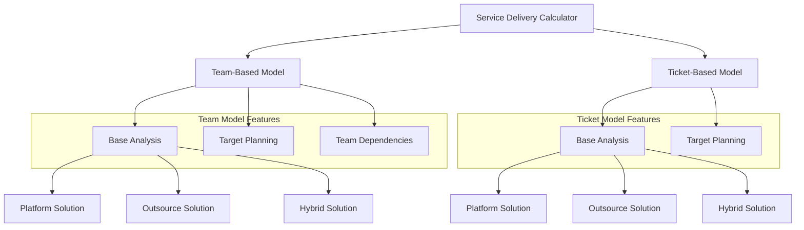
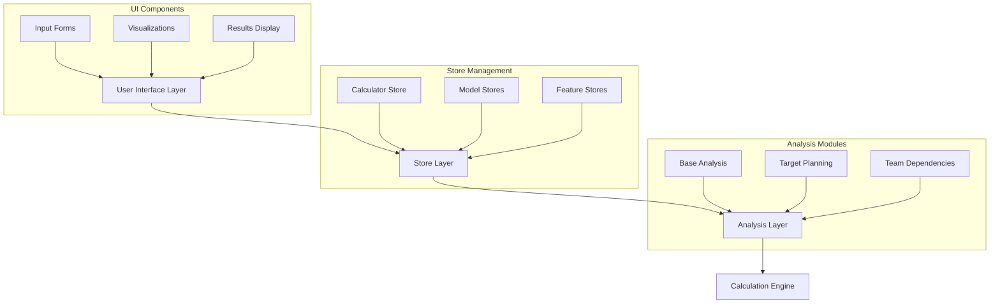
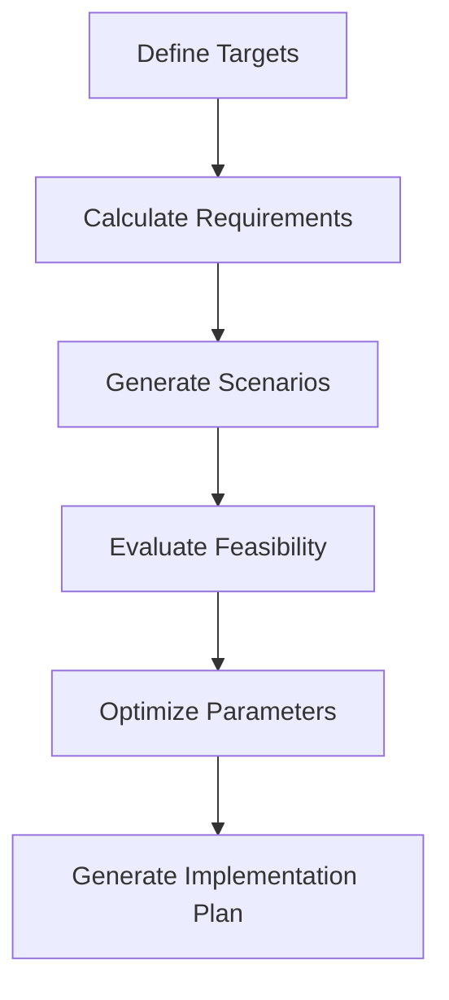
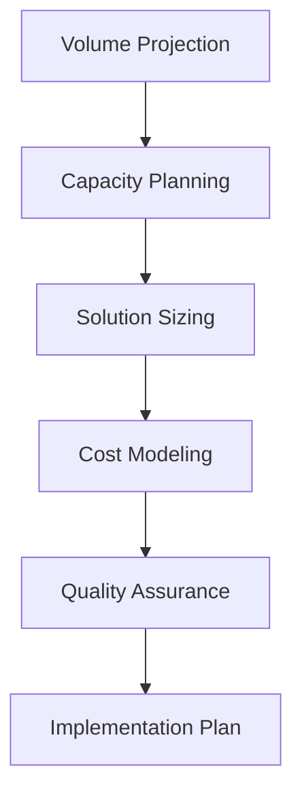
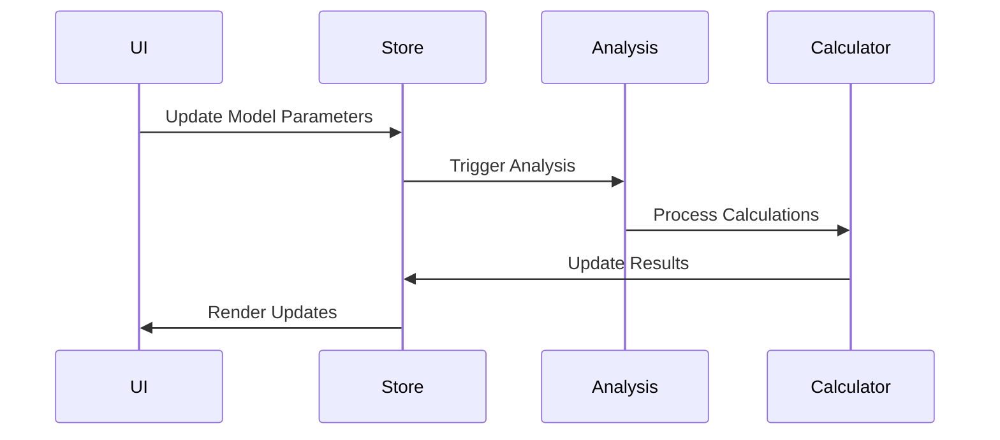

# Service Delivery Cost Analysis - Technical Documentation

## Table of Contents
- [Service Delivery Cost Analysis - Technical Documentation](#service-delivery-cost-analysis---technical-documentation)
  - [Table of Contents](#table-of-contents)
  - [1. Introduction \& Overview](#1-introduction--overview)
    - [1.1 Purpose \& Scope](#11-purpose--scope)
    - [1.2 System Architecture](#12-system-architecture)
    - [1.3 Model Comparison](#13-model-comparison)
  - [2. Team-Based Model](#2-team-based-model)
    - [2.1 Base Analysis](#21-base-analysis)
      - [Core Metrics](#core-metrics)
      - [2.1.1 Platform Solution](#211-platform-solution)
      - [2.1.2 Outsource Solution](#212-outsource-solution)
      - [2.1.3 Hybrid Solution](#213-hybrid-solution)
    - [2.2 Target Planning](#22-target-planning)
    - [2.3 Team Dependencies](#23-team-dependencies)
  - [3. Ticket-Based Model](#3-ticket-based-model)
    - [3.1 Base Analysis](#31-base-analysis)
      - [Core Metrics](#core-metrics-1)
      - [3.1.1 Platform Solution](#311-platform-solution)
      - [3.1.2 Outsource Solution](#312-outsource-solution)
      - [3.1.3 Hybrid Solution](#313-hybrid-solution)
    - [3.2 Target Planning](#32-target-planning)
  - [4. Technical Implementation](#4-technical-implementation)
    - [Store Architecture](#store-architecture)
    - [Data Flow](#data-flow)

## 1. Introduction & Overview

### 1.1 Purpose & Scope

The Service Delivery Calculator is an advanced analysis tool designed to optimize service delivery operations through data-driven decision making. It provides comprehensive cost analysis, optimization strategies, and comparative insights across different service delivery models.



### 1.2 System Architecture



### 1.3 Model Comparison

| Aspect | Team-Based Model | Ticket-Based Model |
|--------|-----------------|-------------------|
| Primary Focus | Resource Optimization | Volume Management |
| Cost Basis | Team Capacity | Transaction Volume |
| Optimization Target | Team Efficiency | Process Efficiency |
| Key Metrics | Team Size, Utilization | Ticket Volume, Processing Time |
| Available Features | Base Analysis, Target Planning, Team Dependencies | Base Analysis, Target Planning |
| Ideal Use Case | Dedicated Service Teams | Transaction-based Services |

## 2. Team-Based Model

### 2.1 Base Analysis

#### Core Metrics

| Metric | Formula | Description |
|--------|---------|-------------|
| Base Monthly Cost | `Team Size × Hourly Rate × 160 × Service Efficiency × (1 + Overhead)` | Total monthly operational cost |
| Annual Cost | `Monthly Cost × 12` | Yearly operational expense |
| Team Efficiency | `Productive Hours ÷ Total Hours × 100` | Team productivity percentage |
| Cost per Resource | `Monthly Cost ÷ Team Size` | Average cost per team member |

#### 2.1.1 Platform Solution

**Input Parameters**
| Parameter | Type | Range | Description |
|-----------|------|-------|-------------|
| Platform Cost | Currency | $50k-$10M | Initial platform investment |
| Build Time | Months | 3-24 | Implementation period |
| Team Reduction | Percentage | 0-75% | Expected team size reduction |
| Process Efficiency | Percentage | 0-75% | Expected efficiency improvement |
| Maintenance Cost | Currency | $1k-$1M/month | Ongoing platform costs |

**Cost Structure**
```
Implementation Cost = Platform Cost + (Current Monthly Cost × Build Time)
Monthly Operating Cost = Reduced Team Cost + Maintenance Cost
where:
Reduced Team Cost = Current Monthly Cost × (1 - Team Reduction) × (1 - Process Efficiency)
```

**ROI Calculations**
```
Monthly Savings = Current Monthly Cost - Monthly Operating Cost
Break Even Months = Implementation Cost ÷ Monthly Savings
Annual ROI = (Monthly Savings × 12 - Implementation Cost) ÷ Implementation Cost × 100
```

**Decision Metrics**
| Metric | Threshold | Decision Impact |
|--------|-----------|-----------------|
| Break Even Period | < 24 months | Project viability |
| Monthly Savings | > 20% of current cost | Solution effectiveness |
| Process Efficiency | > 30% | Automation potential |

#### 2.1.2 Outsource Solution

**Input Parameters**
| Parameter | Type | Range | Description |
|-----------|------|-------|-------------|
| Vendor Rate | Currency | $25-$150/hour | Outsourcing partner rate |
| Transition Time | Months | 1-12 | Knowledge transfer period |
| Management Overhead | Percentage | 10-50% | Additional management cost |
| Quality Impact | Percentage | -20 to +20% | Service quality change |
| Knowledge Loss | Percentage | 0-50% | Expected knowledge degradation |

**Cost Structure**
```
Transition Cost = Current Monthly Cost × Transition Time × 0.5
Base Vendor Cost = Monthly Hours × Vendor Rate
Overhead Cost = Base Vendor Cost × Management Overhead
Quality Adjustment = Base Vendor Cost × |Quality Impact|
Knowledge Factor = 1 + (Knowledge Loss × log₁₀(Transition Time + 1))

Total Monthly Cost = (Base Vendor Cost + Overhead Cost) × Quality Adjustment × Knowledge Factor
```

**Efficiency Impact**
```
Service Level Impact = Current SLA × (1 - |Quality Impact|)
Knowledge Retention = 1 - (Knowledge Loss × (1 - e^(-Transition Time)))
```

#### 2.1.3 Hybrid Solution

**Input Parameters**
| Parameter | Type | Range | Description |
|-----------|------|-------|-------------|
| Platform Portion | Percentage | 0-100% | Work handled by platform |
| Vendor Portion | Percentage | 0-100% | Work outsourced |
| Platform Config | - | Same as Platform | Platform parameters |
| Outsource Config | - | Same as Outsource | Outsourcing parameters |

**Cost Structure**
```
Platform Cost Component = Platform Portion × Platform Solution Cost
Vendor Cost Component = Vendor Portion × Outsource Solution Cost
Total Cost = Platform Cost Component + Vendor Cost Component

Monthly Operating Cost = (Platform Monthly Cost × Platform Portion) +
                        (Vendor Monthly Cost × Vendor Portion)
```

**Optimization Formula**
```
Optimal Split = min(Total Cost) where Platform Portion + Vendor Portion = 100%
```

### 2.2 Target Planning

**Input Parameters**
| Parameter | Type | Range | Description |
|-----------|------|-------|-------------|
| Target ROI | Percentage | > 0% | Desired return on investment |
| Target Timeline | Months | 12-60 | Achievement timeframe |
| Team Reduction | Percentage | 0-75% | Desired team reduction |
| Efficiency Gain | Percentage | 0-75% | Desired efficiency improvement |

**Planning Process**


**Calculation Formulas**
```
Required Monthly Savings = Initial Investment × (1 + Target ROI) ÷ Target Timeline
Required Efficiency = 1 - (Target Operating Cost ÷ Current Cost)
Platform Investment Ceiling = Monthly Savings × Target Timeline × (1 - Risk Factor)
```

### 2.3 Team Dependencies

**Analysis Components**
| Component | Metrics | Analysis Method |
|-----------|---------|-----------------|
| Workflow Dependencies | Lead Time, WIP | Critical Path Analysis |
| Knowledge Dependencies | Knowledge Overlap, Bus Factor | Graph Analysis |
| Resource Dependencies | Resource Utilization, Bottlenecks | Capacity Planning |

**Dependency Calculations**
```
Impact Score = Dependency Weight × Frequency × Criticality
Bottleneck Score = Queue Time ÷ Processing Time
Knowledge Risk = 1 - (Knowledge Holders ÷ Team Size)
```

**Optimization Metrics**
```
Process Efficiency = 1 - (Wait Time ÷ Total Time)
Resource Utilization = Active Time ÷ Available Time
Knowledge Distribution = min(Knowledge Holders per Area)
```

## 3. Ticket-Based Model

### 3.1 Base Analysis

#### Core Metrics

| Metric | Formula | Description |
|--------|---------|-------------|
| Base Monthly Cost | `Tickets × Hours per Ticket × People per Ticket × Rate` | Total processing cost |
| Cost per Ticket | `Monthly Cost ÷ Monthly Tickets` | Unit economics |
| Processing Efficiency | `Minimum Time ÷ Actual Time × 100` | Process efficiency |
| Resource Utilization | `Total Hours Used ÷ Available Hours × 100` | Resource usage |

#### 3.1.1 Platform Solution

**Input Parameters**
| Parameter | Type | Range | Description |
|-----------|------|-------|-------------|
| Automation Rate | Percentage | 0-90% | Tickets automated |
| Processing Time Reduction | Percentage | 0-75% | Time savings per ticket |
| Quality Improvement | Percentage | 0-50% | Error reduction |
| Platform Cost | Currency | $50k-$10M | Implementation cost |

**Cost Structure**
```
Automated Ticket Cost = Standard Ticket Cost × (1 - Automation Rate)
Manual Ticket Cost = Standard Ticket Cost × (1 - Processing Time Reduction)
Monthly Cost = (Automated Tickets × Automated Cost) + (Manual Tickets × Manual Cost)
```

#### 3.1.2 Outsource Solution

**Input Parameters**
| Parameter | Type | Range | Description |
|-----------|------|-------|-------------|
| Vendor Ticket Cost | Currency | $10-$500 | Cost per ticket |
| Volume Commitment | Integer | 50-1000 | Minimum monthly tickets |
| SLA Requirements | Percentage | 90-99.9% | Service level agreement |
| Scaling Factor | Decimal | 0.8-1.2 | Volume scaling cost factor |

**Cost Structure**
```
Base Ticket Cost = Vendor Ticket Cost × Volume Adjustment
Volume Adjustment = (Actual Volume ÷ Committed Volume) ^ Scaling Factor
Quality Premium = Base Cost × (Required SLA ÷ Standard SLA)
```

#### 3.1.3 Hybrid Solution

**Input Parameters**
| Parameter | Type | Range | Description |
|-----------|------|-------|-------------|
| Automation Candidates | Percentage | 0-100% | Tickets for automation |
| Outsource Candidates | Percentage | 0-100% | Tickets for outsourcing |
| Complexity Split | - | Simple/Complex | Ticket routing logic |

**Cost Structure**
```
Automated Cost = Platform Solution Cost × Automation Candidates
Outsourced Cost = Outsource Solution Cost × Outsource Candidates
Internal Cost = Standard Cost × Remaining Tickets
```

### 3.2 Target Planning

**Input Parameters**
| Parameter | Type | Range | Description |
|-----------|------|-------|-------------|
| Volume Growth | Percentage | 0-100% | Expected ticket increase |
| Cost per Ticket Target | Currency | - | Desired unit economics |
| Quality Targets | Percentage | 90-99.9% | Quality objectives |
| Timeline | Months | 12-60 | Implementation period |

**Planning Process**


## 4. Technical Implementation

### Store Architecture
```typescript
interface CalculatorStore {
  model: 'team' | 'ticket';
  solution: 'platform' | 'outsource' | 'hybrid';
  baseAnalysis: BaseAnalysisStore;
  targetPlanning: TargetPlanningStore;
  teamDependencies?: TeamDependencyStore;
  results: CalculationResults;
}
```

### Data Flow
