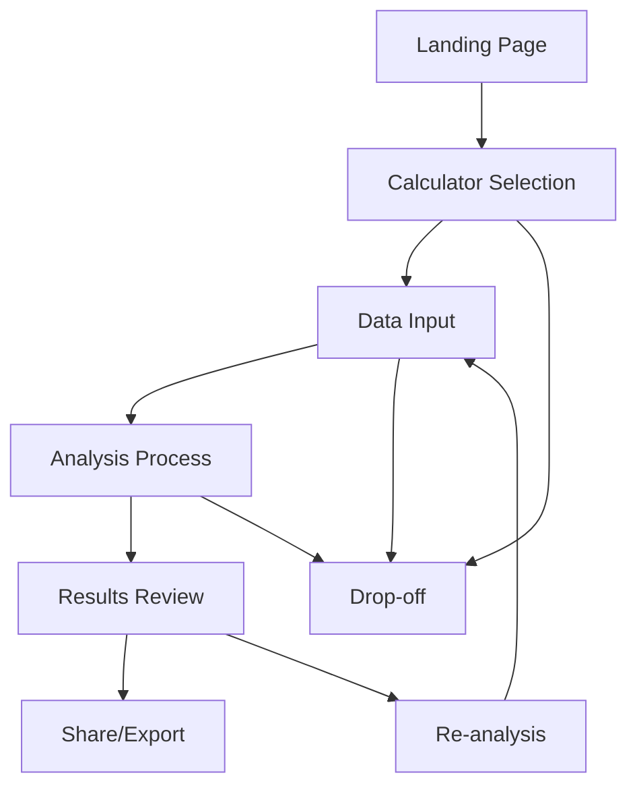
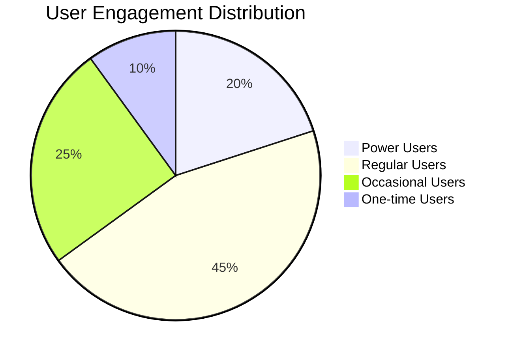

# Operations Cost Calculator Analytics Strategy

## Overview

This document outlines our analytics strategy for the Operations Cost Calculator application. It defines what we measure, why we measure it, and how we'll use these insights to improve the application and user experience.

## Key Business Objectives

1. Increase user engagement and analysis completion rates
2. Understand user behavior patterns and preferences
3. Identify potential bottlenecks and drop-off points
4. Drive feature adoption and usage
5. Inform product development decisions

## Analytics Framework

### 1. Core Analysis Types

| Analysis Type | Description | Key Metrics | Business Value |
|--------------|-------------|-------------|----------------|
| Build vs Buy | Cost comparison for build or buy decisions | - Completion rate - Average decision time - Preferred solutions | Understand how organizations make build vs buy decisions |
| Feature Value | Feature cost and impact analysis | - Features analyzed/session - Value assessment patterns - Confidence scores | Track feature prioritization patterns |
| Internal Analysis | Internal resource cost analysis | - Team size inputs - Cost distribution - Calculation accuracy | Understand internal costing patterns |
| Target Planning | Future state planning and costing | - Planning horizon - Target scenarios created - Revision frequency | Track organizational planning trends |

### 2. User Journey Tracking

#### Key Journey Metrics

| Stage | Metrics | Purpose |
|-------|---------|----------|
| Entry | - Source/medium - Initial page engagement - Calculator selection time | Understand user acquisition and initial engagement |
| Data Input | - Form completion rate - Field error rates - Input patterns | Identify form optimization opportunities |
| Analysis | - Time per step - Step completion rates - Help content usage | Track analysis efficiency and pain points |
| Results | - Time on results page - Export rate - Share rate | Measure result utilization |
| Re-engagement | - Return rate - Analysis modifications - Cross-calculator usage | Track long-term value delivery |

### 3. Feature Usage Analysis

#### Core Features

| Feature Category | Tracking Points | Insights Goal |
|-----------------|-----------------|---------------|
| Calculator Tools | - Tool selection - Input patterns - Calculation triggers | Feature adoption and usage patterns |
| Data Visualization | - Chart interactions - Export actions - View duration | Understanding data consumption preferences |
| Collaboration | - Share link generation - Team invites - Comment activity | Measuring collaboration effectiveness |
| Templates | - Template usage - Customization rate - Save frequency | Template value assessment |

#### User Engagement Levels

### 4. Custom Dimensions

#### User Properties
- Organization Size
- Industry Vertical
- User Role
- Account Type

#### Session Properties
- Analysis Type
- Feature Usage Count
- Session Duration
- Interaction Depth

#### Content Properties
- Calculator Type
- Template Usage
- Help Content Access
- Export Format

## Analytics Implementation Priorities

### Phase 1: Core Tracking
1. Basic user journey tracking
2. Essential event tracking
3. User property collection

### Phase 2: Enhanced Analytics
1. Detailed funnel analysis
2. Advanced user segmentation
3. Custom report setup

### Phase 3: Advanced Insights
1. Predictive analytics
2. User behavior patterns
3. ROI tracking

## Key Performance Indicators (KPIs)

### User Engagement
- Daily Active Users (DAU)
- Monthly Active Users (MAU)
- Average Session Duration
- Pages per Session

### Analysis Performance
- Analysis Completion Rate
- Average Time to Complete
- Re-analysis Rate
- Template Usage Rate

### Feature Adoption
- Feature Discovery Rate
- Feature Usage Frequency
- Feature Stickiness
- Cross-feature Usage

### Business Impact
- User Return Rate
- Share/Export Rate
- Template Creation Rate
- Help Content Effectiveness

## Reporting Framework

### 1. Executive Dashboard
- High-level KPIs
- User growth trends
- Feature adoption rates
- Analysis completion metrics

### 2. Product Analytics
- Detailed user flows
- Feature usage patterns
- Drop-off analysis
- A/B test results

### 3. User Behavior
- Session recordings
- Heatmaps
- Form analytics
- Error tracking

## Custom Segments

### User Types
1. Power Users
   - Multiple analyses per week
   - High feature adoption
   - Regular template usage

2. Regular Users
   - Weekly usage
   - Standard feature set
   - Occasional template use

3. Occasional Users
   - Monthly usage
   - Basic feature set
   - Rare template use

### Industry Segments
- Technology
- Manufacturing
- Services
- Healthcare
- Retail

## Success Metrics

| Metric | Target | Measurement Frequency |
|--------|--------|---------------------|
| Analysis Completion Rate | >75% | Weekly |
| User Return Rate | >50% | Monthly |
| Feature Adoption Rate | >60% | Monthly |
| Template Usage | >40% | Weekly |
| Share/Export Rate | >25% | Weekly |

## Data Quality & Governance

### Data Collection Standards
1. Consistent naming conventions
2. Required property validation
3. Data sampling guidelines
4. Privacy compliance

### Data Quality Monitoring
1. Regular accuracy checks
2. Missing data monitoring
3. Anomaly detection
4. Data freshness tracking

## Review & Optimization Process

### Weekly Review
- Basic KPI tracking
- Anomaly investigation
- Short-term trends

### Monthly Review
- Detailed performance analysis
- Feature adoption trends
- User segment analysis

### Quarterly Review
- Strategic metric assessment
- Long-term trend analysis
- Goal adjustment

## Implementation Checklist

- [ ] GTM Account Setup
- [ ] GA4 Property Configuration
- [ ] Custom Dimension Setup
- [ ] Event Tracking Implementation
- [ ] User Property Collection
- [ ] Dashboard Creation
- [ ] Report Configuration
- [ ] Testing Protocol
- [ ] Documentation
- [ ] Team Training

## Next Steps

1. Review and finalize tracking plan
2. Set up development environment tracking
3. Implement core tracking
4. Validate data collection
5. Create initial dashboards
6. Monitor and adjust 