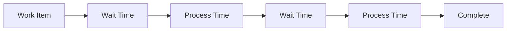
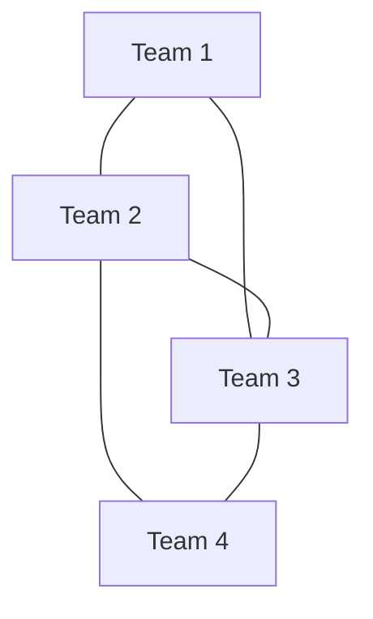
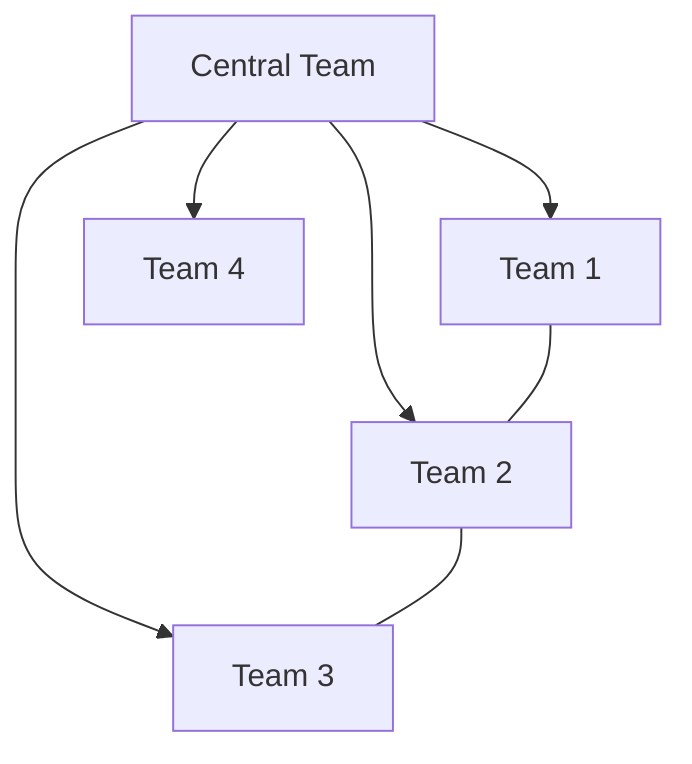

# Technical Documentation: Internal Analysis & Target-Based Planning

# Part I: Internal Analysis

## Overview

Internal Analysis is designed to help organizations understand and optimize their team interactions, dependencies, and workflow efficiency. This analysis focuses on three key aspects:
1. Team dependencies and their impact
2. Work distribution and flow efficiency
3. Coordination costs and optimization opportunities

## 1. Team Dependency Analysis

### Motivation
Team dependencies in modern organizations can significantly impact productivity, lead times, and costs. Understanding these dependencies helps:
- Identify bottlenecks and inefficiencies
- Optimize team structures and interactions
- Reduce coordination overhead
- Improve delivery predictability

### Key Metrics and Formulations

#### 1.1 Dependency Impact Score (DIS)
```
DIS = Σ(Wi × Di × Ci)

Where:
- Wi = Work item volume between teams i
- Di = Dependency strength (1-5 scale)
- Ci = Coordination cost factor
```

This metric quantifies the overall impact of dependencies by considering:
- Volume of work items exchanged between teams
- Strength/criticality of dependencies
- Associated coordination costs

| Dependency Strength | Description | Example |
|-------------------|-------------|----------|
| 1 | Minimal | Occasional information sharing |
| 2 | Low | Regular updates needed |
| 3 | Medium | Shared deliverables |
| 4 | High | Critical path dependencies |
| 5 | Critical | Blocking dependencies |

#### 1.2 Flow Efficiency Analysis



**Flow Efficiency (FE)**
```
FE = (Σ VAT) / (Σ LT) × 100%

Where:
- VAT = Value-added time (actual work)
- LT = Total lead time (including wait times)
```

This metric helps understand:
- Actual value-adding activities vs. wait times
- Process efficiency
- Opportunity areas for improvement

### Input Parameters

| Parameter | Type | Description | Example |
|-----------|------|-------------|----------|
| Team Size | Integer | Number of team members | 7 |
| Dependencies | Matrix | Team dependency mapping | [See Matrix Below] |
| WIP Limits | Integer | Maximum concurrent work | 5 |
| Throughput | Float | Items completed per time | 3.5/week |

**Dependency Matrix Example:**
```
    T1  T2  T3  T4
T1  -   3   1   0
T2  3   -   2   1
T3  1   2   -   4
T4  0   1   4   -
```

### Output Metrics

#### 1.3 System Performance Indicators

| Metric | Formula | Target Range | Action if Outside Range |
|--------|---------|--------------|------------------------|
| Flow Efficiency | FE = VAT/LT | > 40% | Review handoffs and wait times |
| WIP Impact | WIS = Σ(WIPi/Ti) | < 1.5 | Adjust WIP limits |
| Lead Time | SLT = Σ(LTi × Di/Dmax) | Varies | Analyze bottlenecks |

## 2. Distribution Models

### 2.1 Even Distribution Model

This model optimizes for balanced team dependencies and workload.



**Key Characteristics:**
- Equal number of dependencies per team
- Balanced workload distribution
- Minimized coordination overhead

**Dependency Balance Index (DBI)**
```
DBI = σ(Di) / μ(Di)

Target: DBI < 0.3 indicates good balance
```

### 2.2 Uneven Distribution (Hub-and-Spoke)

Optimized for scenarios with natural centralization.



**Centrality Impact (CI)**
```
CI = (Dc / Davg) × (Tc / Tavg)

Where:
- Dc = Central team dependencies
- Davg = Average team dependencies
- Tc = Central team throughput
- Tavg = Average team throughput
```

### Cost Analysis

#### Coordination Cost Breakdown

```
Total Cost = Direct Costs + Indirect Costs + Overhead

Where:
- Direct Costs = Meeting costs + Communication time
- Indirect Costs = Context switching + Wait times
- Overhead = Management coordination + Tools
```

**Annual Cost Calculation:**
```
Annual Cost per Team = Base Cost × (1 + Dependency Factor)

Where:
Base Cost = Team Size × Hourly Rate × Annual Hours
Dependency Factor = Number of Dependencies × 0.15
```

# Part II: Target-Based Planning

## Overview

Target-Based Planning helps organizations set realistic improvement goals and create actionable implementation plans based on their service delivery model. The planning approach differs based on whether the organization uses a team-based or ticket-based model.

## 1. Model-Specific Analysis

### 1.1 Team-Based Planning

This model focuses on optimizing team capacity and efficiency.

#### Key Inputs
- Annual labor cost (team size × hourly rate × hours)
- Current team efficiency metrics
  - Service efficiency (%)
  - Operational overhead (%)
- Target savings
- ROI period
- Team capacity metrics
  - Team size
  - Hourly rates
  - Manual work percentage

#### Maximum Allowable Investment (MAI)

```
MAI_team = min(0.5 × AC_team, 1.5 × TS)

Where:
- AC_team = Annual labor cost (team-based)
- TS = Target savings over ROI period
```

#### Efficiency Targets

Required Team Efficiency Gains (RTEG) calculation:

```
RTEG = min(MS / (N × H × W), MC)

Where:
- MS = Monthly savings target
- N = Team size
- H = Hourly rate
- W = Working hours
- MC = Current manual work percentage
```

### 1.2 Ticket-Based Planning

This model focuses on optimizing cost per ticket and volume handling.

#### Key Inputs
- Annual ticket volume
- Current ticket metrics
  - Hours per ticket
  - People per ticket
  - Vendor rate
- Target savings
- ROI period
- Volume capacity metrics
  - Monthly tickets
  - Resource allocation
  - Processing efficiency

#### Maximum Allowable Investment (MAI)

```
MAI_ticket = min(0.5 × AC_ticket, 1.5 × TS)

Where:
- AC_ticket = Annual cost (ticket volume × cost per ticket)
- TS = Target savings over ROI period
```

#### Efficiency Targets

Required Ticket Efficiency Gains (RTEG) calculation:

```
RTEG = min(MS / (M × T × P), PE)

Where:
- MS = Monthly savings target
- M = Monthly tickets
- T = Hours per ticket
- P = People per ticket
- PE = Current processing efficiency
```

## 2. Break-even Analysis

### 2.1 Team-Based Scenarios

Three standard scenarios analyzed for team-based model:

| Parameter | Conservative | Moderate | Aggressive |
|-----------|-------------|-----------|------------|
| Team Reduction | 10% | 15% | 20% |
| Service Efficiency | +15% | +25% | +35% |
| Operational Overhead | -5% | -10% | -15% |
| Monthly Savings | MAI/24 | MAI/18 | MAI/12 |

### 2.2 Ticket-Based Scenarios

Three standard scenarios for ticket-based model:

| Parameter | Conservative | Moderate | Aggressive |
|-----------|-------------|-----------|------------|
| Processing Time | -10% | -20% | -30% |
| Resource Allocation | -15% | -25% | -35% |
| Quality Impact | +5% | +10% | +15% |
| Monthly Savings | MAI/24 | MAI/18 | MAI/12 |

## 3. Implementation Process

### Phase 1: Model-Specific Analysis
1. Select appropriate model (team/ticket)
2. Collect relevant baseline metrics
3. Define model-specific targets

### Phase 2: Planning
1. Choose scenario based on model constraints
2. Define specific improvement targets
3. Create model-appropriate roadmap

### Phase 3: Execution
1. Implement changes according to model
2. Monitor model-specific KPIs
3. Adjust based on chosen model

## 4. Validation and Monitoring

### Team-Based KPIs

| KPI | Formula | Target | Frequency |
|-----|---------|--------|-----------|
| Team Efficiency | (Actual Output / Expected Output) × 100 | Model dependent | Weekly |
| Operational Overhead | (Overhead Time / Total Time) × 100 | -20% minimum | Monthly |
| Service Quality | (Successful Deliveries / Total) × 100 | +15% minimum | Weekly |

### Ticket-Based KPIs

| KPI | Formula | Target | Frequency |
|-----|---------|--------|-----------|
| Processing Efficiency | (Actual Time / Standard Time) × 100 | Model dependent | Daily |
| Resource Utilization | (Used Resources / Allocated) × 100 | +25% minimum | Weekly |
| Ticket Quality | (Error-free Tickets / Total) × 100 | +20% minimum | Daily |

### Risk Management

| Risk Category | Team-Based Mitigation | Ticket-Based Mitigation |
|--------------|----------------------|------------------------|
| Process Changes | Gradual team adaptation | Phased ticket routing |
| Quality Control | Peer review system | Automated validation |
| Resource Management | Cross-training | Dynamic allocation |

## Conclusion

This technical documentation provides a comprehensive framework for:
1. Analyzing current state based on delivery model
2. Planning improvements specific to team or ticket approach
3. Monitoring and validating results based on model-specific metrics

The calculations and approaches should be adapted based on:
- Chosen delivery model (team/ticket)
- Organization-specific constraints
- Model-specific optimization opportunities