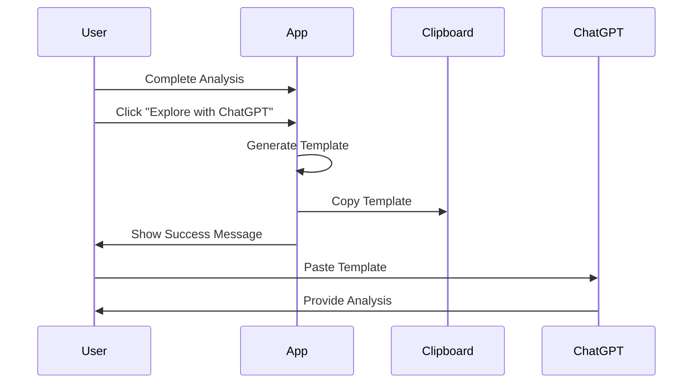
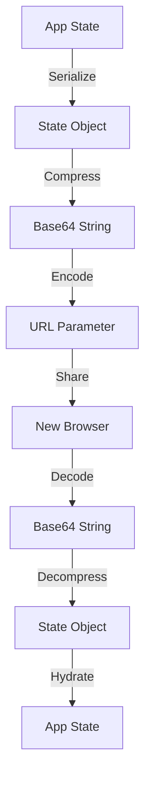
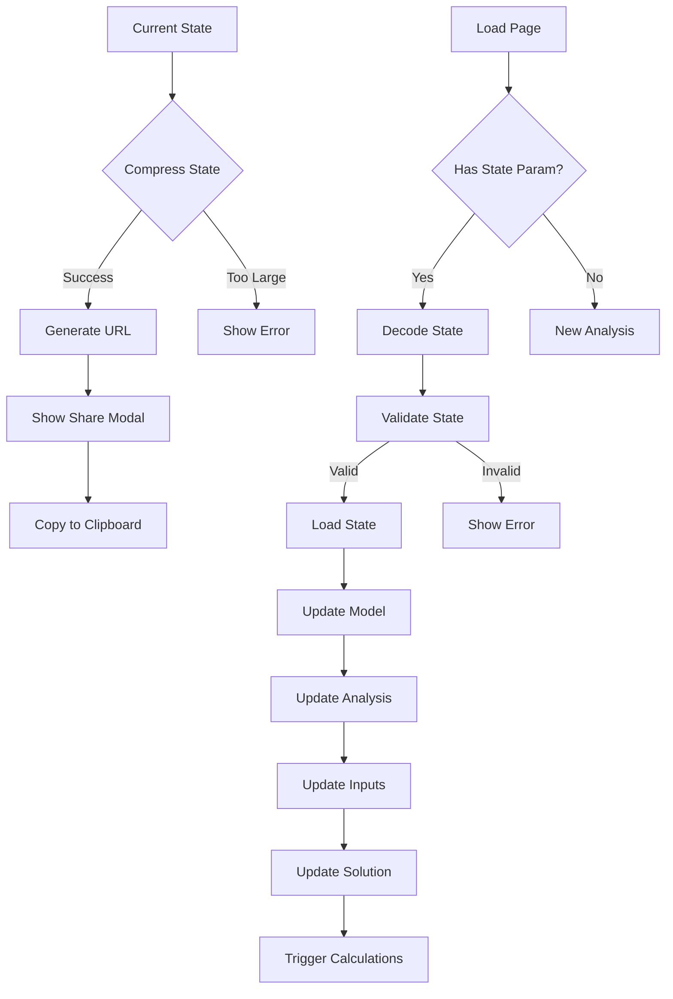
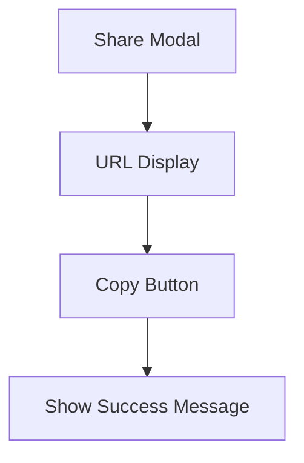
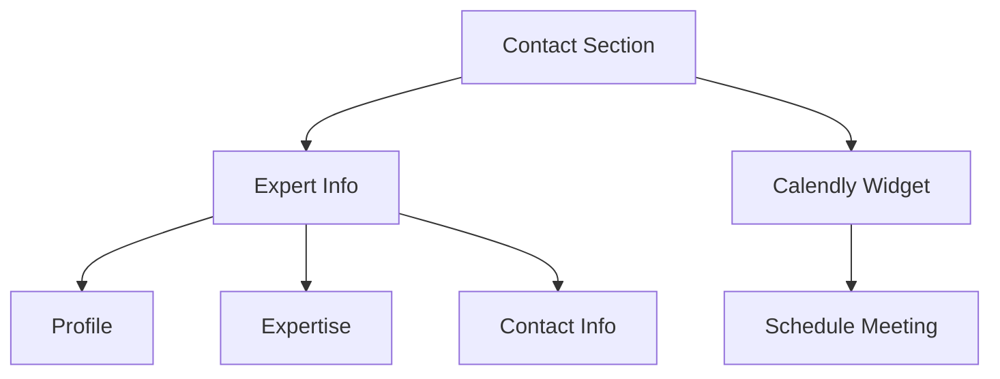
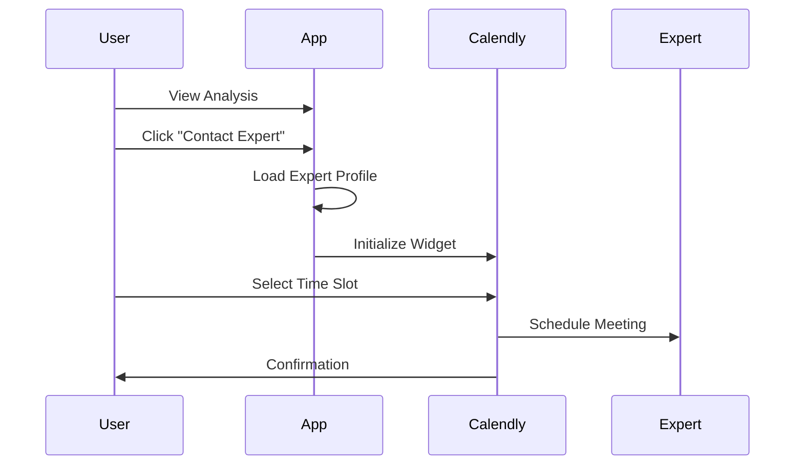
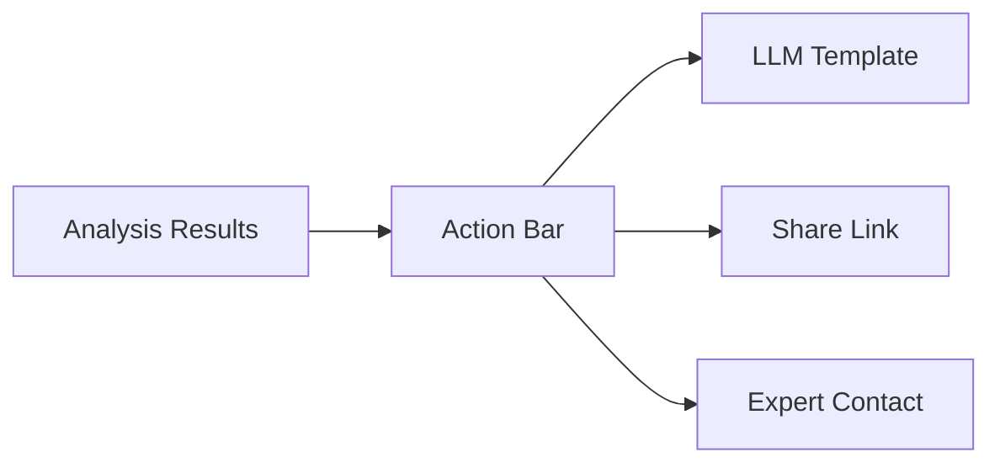
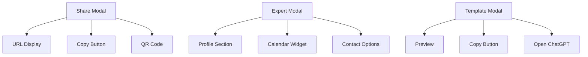

# Milestone 3: Enhanced Analysis Features

## Overview

This milestone introduces three key features to enhance user engagement and analysis sharing capabilities:
1. LLM Template Summary
2. Analysis Sharing via URL
3. Expert Consultation Integration

## Feature Matrix

| Feature | Complexity | Dependencies |
|---------|------------|--------------
| LLM Template | Medium | None 
| Share Link | Medium | URL State Management 
| Contact Expert | Low | Calendly Integration

## 1. LLM Template Summary

### Purpose
Enable users to explore their analysis deeper through AI-powered insights by automatically generating a context-rich prompt for ChatGPT.

### User Flow


### Template Structure
```typescript
interface TemplateData {
  analysisType: 'base' | 'target' | 'internal';
  inputs: {
    [key: string]: any;
  };
  results: {
    [key: string]: any;
  };
  context: string;
}
```

## 2. Share Link Feature

### Purpose
Enable users to share their analysis state via URL, allowing others to view and modify the analysis with pre-populated values.

### Architecture Overview


### State Management

#### State Structure
```typescript
interface ShareableState {
  v: string;                 // Version number
  t: number;                 // Timestamp
  m: 'team' | 'ticket';      // Model type
  a: 'base' | 'target' | 'team';  // Analysis type
  d: ModelSpecificData;      // Model-specific data
}

// Base Analysis State
interface BaseAnalysisData {
  i: {  // Inputs
    // Team Model
    ts?: number;   // Team size
    hr?: number;   // Hourly rate
    se?: number;   // Service efficiency (0-100)
    oo?: number;   // Operational overhead (0-100)
    
    // Ticket Model
    mt?: number;   // Monthly tickets
    ht?: number;   // Hours per ticket
    pt?: number;   // People per ticket
    sc?: number;   // SLA compliance (0-100)
  };
  s?: {  // Selected solution
    t: 'platform' | 'outsource' | 'hybrid';  // Solution type
    d: PlatformData | OutsourceData | HybridData;  // Solution-specific data
  };
}

// Target Analysis State
interface TargetAnalysisData {
  i: BaseAnalysisData['i'];  // Base inputs
  t: {  // Targets
    tt: 'roi' | 'team' | 'efficiency';  // Target type
    tv: number;   // Target value
    tf: number;   // Timeframe
  }[];
}

// Team Analysis State
interface TeamAnalysisData {
  t: {  // Teams
    id: string;
    n: string;    // Name
    s: number;    // Size
    e: number;    // Efficiency
  }[];
  d: {  // Dependencies
    f: string;    // From team
    t: string;    // To team
    ty: string;   // Type
    s: number;    // Strength
  }[];
}
```

### UI State Management

#### State Updates
```typescript
interface StateManager {
  // Save current state to URL
  saveState(): string;
  
  // Load state from URL
  loadState(state: string): void;
  
  // Update UI components
  updateUI(state: ShareableState): void;
}

interface UIStateUpdater {
  // Update model selection
  updateModelSelection(model: 'team' | 'ticket'): void;
  
  // Update analysis type
  updateAnalysisType(type: 'base' | 'target' | 'team'): void;
  
  // Update form inputs
  updateInputs(inputs: Record<string, number>): void;
  
  // Update solution selection
  updateSolution(solution: 'platform' | 'outsource' | 'hybrid'): void;
  
  // Update solution inputs
  updateSolutionInputs(inputs: Record<string, number>): void;
}
```

### Implementation Flow


### Share Modal Design


### State Validation Rules
1. Version compatibility check
2. Required fields validation
3. Value range validation
4. Model-specific validation
5. Analysis-type validation

### Error Handling
```typescript
interface StateError {
  code: string;
  message: string;
  details?: any;
}

enum StateErrorCode {
  INVALID_VERSION = 'INVALID_VERSION',
  MISSING_REQUIRED = 'MISSING_REQUIRED',
  INVALID_VALUE = 'INVALID_VALUE',
  COMPRESSION_ERROR = 'COMPRESSION_ERROR',
  DECOMPRESSION_ERROR = 'DECOMPRESSION_ERROR'
}
```

### URL Structure
```
https://app.com/calculator/{analysis_type}/{model}#state={base64EncodedState}
```

### Security Considerations
1. No sensitive data in URL
2. State validation before loading
3. Input sanitization
4. URL length limits
5. Version control for backwards compatibility

## 3. Expert Consultation

### Layout Design


### Component Structure
```typescript
interface ExpertProfile {
  name: string;
  title: string;
  expertise: string[];
  image: string;
  calendlyUrl: string;
  contactInfo: {
    email: string;
    linkedin?: string;
    twitter?: string;
  };
}
```

### Integration Flow


## Technical Requirements

### State Serialization
```typescript
// Maximum URL length considerations
const MAX_STATE_SIZE = 2000; // characters
const COMPRESSION_RATIO = 0.7; // estimated

interface StateManager {
  serialize(): string;
  deserialize(state: string): ShareableState;
  validate(state: ShareableState): boolean;
  compress(data: string): string;
  decompress(data: string): string;
}
```

### Feature Flags
```typescript
interface FeatureFlags {
  enableLLMTemplate: boolean;
  enableSharing: boolean;
  enableExpertContact: boolean;
  debugMode: boolean;
}
```

## UI/UX Considerations

### Button Placement


### Modal Designs

