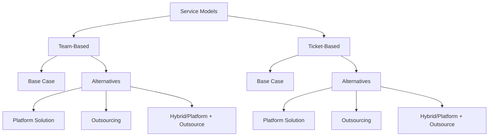
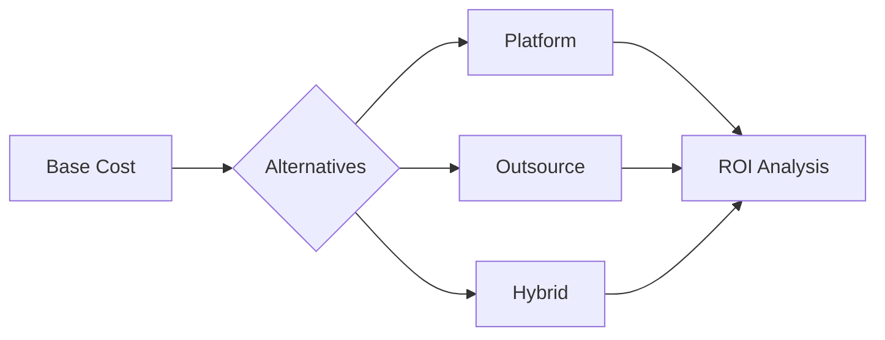
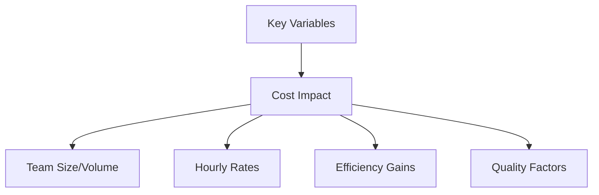

# Service Delivery Models Documentation

## Model Overview



## Team-Based Model

### Input Categories

#### Base Case Parameters
| Category | Parameter | Description | Range |
|----------|-----------|-------------|--------|
| Team Configuration | Team Size | Active FTEs | 1-1000 |
| | Hourly Rate | Cost per FTE | $1-1000 |
| | Service Delivery % | Time on service | 0-100% |
| Operational | Working Hours | Monthly hours | 120-200 |
| | Overhead % | Administrative overhead | 0-100% |

#### Platform Alternative
| Category | Parameter | Description | Range |
|----------|-----------|-------------|--------|
| Development | Initial Cost | Platform investment | $0-10M |
| | Build Time | Implementation period | 1-24 months |
| Operations | Maintenance Cost | Monthly upkeep | $0-1M |
| | Team Reduction % | Staff efficiency gain | 0-100% |
| | Process Efficiency % | Automation impact | 0-100% |

#### Outsourcing Alternative
| Category | Parameter | Description | Range |
|----------|-----------|-------------|--------|
| Vendor | Hourly Rate | Vendor cost | $1-1000 |
| | Transition Time | Handover period | 1-12 months |
| | Transition Cost | One-time cost | $0-1M |
| Impact | Management Overhead % | Additional oversight | 0-100% |
| | Quality Impact % | Service degradation | 0-100% |
| | Knowledge Loss % | Expertise reduction | 0-100% |

#### Hybrid Alternative
| Category | Parameter | Description | Range |
|----------|-----------|-------------|--------|
| Platform | Platform % | Platform coverage | 0-100% |
| | Platform Cost | Reduced investment | $0-10M |
| Outsourcing | Vendor % | Outsourced portion | 0-100% |
| | Vendor Rate | Reduced rate | $1-1000 |

### Calculations

#### Base Case Cost
$$C_{base} = teamSize \times hourlyRate \times workingHours \times (1 + \frac{overhead}{100}) \times \frac{serviceDelivery}{100}$$

#### Platform Solution
$$C_{platform} = C_{base} \times (1 - \frac{teamReduction}{100}) \times (1 - \frac{processEfficiency}{100}) + maintenanceCost$$

#### Outsourcing Cost
$$C_{outsource} = vendorRate \times workingHours \times (1 + \frac{managementOverhead}{100}) \times (1 + \frac{qualityImpact}{100})$$

#### Hybrid Solution
$$C_{hybrid} = (C_{platform} \times \frac{platformPercent}{100}) + (C_{outsource} \times \frac{vendorPercent}{100})$$

## Ticket-Based Model

### Input Categories

#### Base Case Parameters
| Category | Parameter | Description | Range |
|----------|-----------|-------------|--------|
| Volume | Monthly Tickets | Request volume | 1-10000 |
| | Hours per Ticket | Resolution time | 0.1-100 |
| Resources | People per Ticket | Team members needed | 1-10 |
| | Hourly Rate | Internal cost | $1-1000 |
| Quality | SLA Compliance % | Service level met | 0-100% |

#### Platform Alternative
| Category | Parameter | Description | Range |
|----------|-----------|-------------|--------|
| Development | Initial Cost | Platform investment | $0-10M |
| | Build Time | Implementation period | 1-24 months |
| Impact | Automation % | Automated tickets | 0-100% |
| | Time Reduction % | Processing speed gain | 0-100% |
| | Quality Improvement % | Error reduction | 0-100% |

#### Outsourcing Alternative
| Category | Parameter | Description | Range |
|----------|-----------|-------------|--------|
| Vendor | Ticket Cost | Cost per ticket | $1-1000 |
| | Transition Time | Handover period | 1-12 months |
| Quality | SLA Impact % | Service level change | -100-100% |
| | Resolution Time % | Time impact | -100-100% |

#### Hybrid Alternative
| Category | Parameter | Description | Range |
|----------|-----------|-------------|--------|
| Split | Automated % | Platform handled | 0-100% |
| | Outsourced % | Vendor handled | 0-100% |
| | Manual % | Internal handled | 0-100% |

### Calculations

#### Base Case Cost
$$C_{ticket} = monthlyTickets \times hoursPerTicket \times peoplePerTicket \times hourlyRate$$

#### Platform Solution
$$C_{platform} = monthlyTickets \times (automationPercent \times automatedCost + (1-automationPercent) \times manualCost)$$

#### Outsourcing Cost
$$C_{outsource} = monthlyTickets \times ticketCost \times (1 + \frac{slaImpact}{100})$$

#### Hybrid Solution
$$C_{hybrid} = monthlyTickets \times (\frac{automated}{100} \times platformCost + \frac{outsourced}{100} \times vendorCost + \frac{manual}{100} \times internalCost)$$

## Visualization Framework

### Cost Comparison


### Break-even Analysis
| Solution | Formula | Factors |
|----------|----------|----------|
| Platform | $$Months = \frac{platformCost}{monthlySavings}$$ | Development cost, Efficiency gains |
| Outsource | $$Months = \frac{transitionCost}{monthlySavings}$$ | Transition cost, Rate difference |
| Hybrid | $$Months = \frac{platformCost + transitionCost}{monthlySavings}$$ | Combined investments |

### Sensitivity Analysis


## Real-time Updates

### Reactive Elements
1. **Immediate Calculations**
   - Cost updates on input change
   - Break-even point adjustments
   - ROI recalculation

2. **Visual Updates**
   - Cost comparison charts
   - Efficiency indicators
   - Quality metrics

3. **Risk Indicators**
   - Input validation
   - Threshold warnings
   - Optimization suggestions
```

