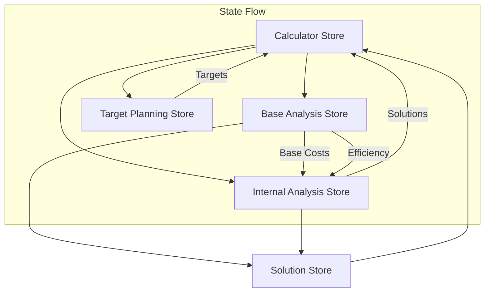
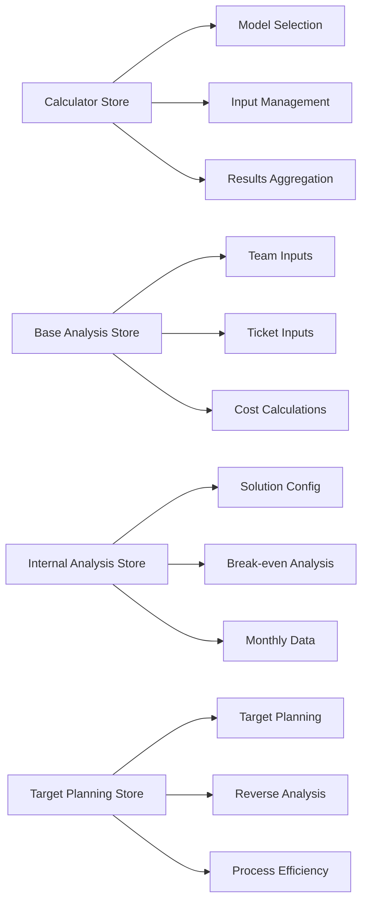
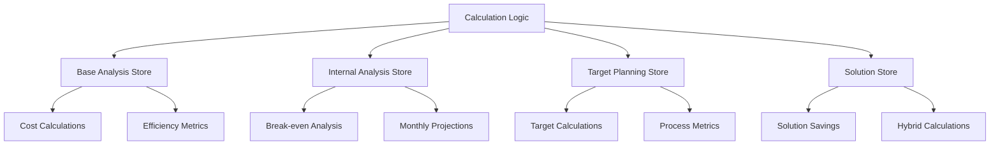
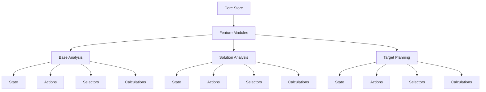

# Cost Analysis Calculator Refactoring Plan

## Current State Analysis

### 1. Store Architecture Overview

The application uses a multi-store architecture with several interconnected stores:

| Store | Primary Responsibility | Dependencies |
|-------|----------------------|--------------|
| Calculator Store | Main coordinator, model selection | All other stores |
| Base Analysis Store | Cost calculations, input management | None |
| Internal Analysis Store | Solution calculations, break-even analysis | Base Analysis Store |
| Target Planning Store | Planning calculations, process efficiency | Base Analysis Store |
| Solution Store | Solution configurations, savings calculations | Base Analysis, Internal Analysis |

### 2. Data Flow and Dependencies



### 3. Current Store Structure



### 4. Identified Problems

#### 4.1 Complex State Management
- **Store Coupling**: Multiple stores with overlapping responsibilities and circular dependencies
- **State Synchronization**: Complex logic to keep stores in sync
- **State Updates**: Difficult to track and debug state changes
- **Initialization Order**: Complex store initialization and reset logic

#### 4.2 Type System Issues

| Issue | Impact | Example |
|-------|---------|---------|
| Duplicate Types | Maintenance overhead | `CalculatorModel` defined multiple times |
| Inconsistent Usage | Type safety gaps | Missing type guards for discriminated unions |
| Complex Hierarchies | Difficult to maintain | Deep nesting in solution configurations |
| Validation Logic | Scattered across components | Input constraints defined in multiple places |

#### 4.3 Calculation Logic Distribution



#### 4.4 Component Integration Issues
- Components tightly coupled to multiple stores
- Complex prop drilling for deep component hierarchies
- Inconsistent store usage patterns
- Difficult to test components in isolation

## Proposed Solution

### 1. Unified Store Architecture

```typescript
// Core state structure
interface CoreState {
  model: ModelState;
  inputs: InputState;
  calculations: CalculationState;
  solutions: SolutionState;
  ui: UIState;
}

interface ModelState {
  type: 'team' | 'ticket';
  config: ModelConfig;
}

interface InputState {
  team?: TeamInputs;
  ticket?: TicketInputs;
  validation: ValidationState;
}

interface CalculationState {
  base: BaseCalculations;
  solutions: SolutionCalculations;
  comparison: ComparisonResults;
}

interface SolutionState {
  type: SolutionType;
  config: SolutionConfig;
  results: SolutionResults;
}

interface UIState {
  activeView: ViewType;
  notifications: Notification[];
  loading: LoadingState;
}
```

### 2. Feature-based Organization



### 3. Calculation Service Layer

```typescript
// Calculation service architecture
interface CalculationService {
  baseAnalysis: BaseAnalysisCalculator;
  solutionAnalysis: SolutionAnalysisCalculator;
  targetPlanning: TargetPlanningCalculator;
  comparison: ComparisonCalculator;
}

// Strategy pattern for calculations
interface CostCalculationStrategy {
  calculate(inputs: BaseInputs): CostResults;
}

class TeamCostStrategy implements CostCalculationStrategy {
  calculate(inputs: TeamInputs): CostResults {
    // Team-specific calculations
  }
}

class TicketCostStrategy implements CostCalculationStrategy {
  calculate(inputs: TicketInputs): CostResults {
    // Ticket-specific calculations
  }
}
```

### 4. Type System Improvements

```typescript
// Input type hierarchy
type BaseInputs = TeamInputs | TicketInputs;

interface TeamInputs {
  type: 'team';
  data: TeamInputData;
}

interface TicketInputs {
  type: 'ticket';
  data: TicketInputData;
}

// Validation schemas
const inputSchemas = {
  team: z.object({
    teamSize: z.number().min(1).max(100),
    hourlyRate: z.number().min(0),
    // ...
  }),
  ticket: z.object({
    monthlyTickets: z.number().min(0),
    // ...
  })
};

// Type guards
function isTeamInputs(input: BaseInputs): input is TeamInputs {
  return input.type === 'team';
}

function isTicketInputs(input: BaseInputs): input is TicketInputs {
  return input.type === 'ticket';
}
```

### 5. Implementation Plan

#### Phase 1: Core Architecture (Weeks 1-2)
- [ ] Implement new store structure
- [ ] Create feature modules
- [ ] Set up calculation service
- [ ] Establish type system

#### Phase 2: Feature Migration (Weeks 3-4)
- [ ] Migrate base analysis
- [ ] Migrate solution analysis
- [ ] Migrate target planning
- [ ] Update components

#### Phase 3: Integration (Weeks 5-6)
- [ ] Connect features
- [ ] Implement cross-feature calculations
- [ ] Add validation layer
- [ ] Update UI components

#### Phase 4: Testing & Optimization (Weeks 7-8)
- [ ] Unit tests for calculations
- [ ] Integration tests for features
- [ ] Performance optimization
- [ ] Documentation

### 6. Benefits

| Benefit | Description | Impact |
|---------|-------------|---------|
| Maintainability | Clear separation of concerns | Easier to modify and extend |
| Type Safety | Comprehensive type system | Fewer runtime errors |
| Testability | Isolated components and logic | Better test coverage |
| Performance | Optimized state updates | Faster calculations |
| Developer Experience | Clear patterns and organization | Faster development |

### 7. Migration Strategy

1. **Create New Structure**
   - Implement core store
   - Set up feature modules
   - Create calculation services

2. **Parallel Implementation**
   - Keep existing code functional
   - Implement features in parallel
   - Gradual migration

3. **Testing and Validation**
   - Verify calculations
   - Compare results
   - Performance testing

4. **Cleanup**
   - Remove old code
   - Update documentation
   - Final testing 