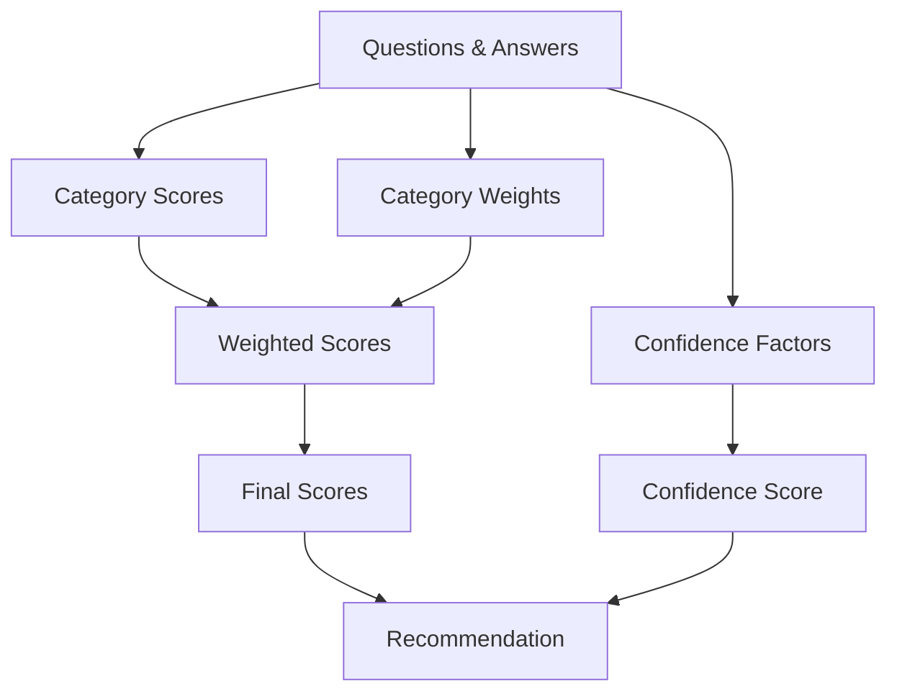

# Build vs Buy Analysis Scoring Logic

## 1. Overview

This document explains how the Build vs Buy analysis tool calculates its recommendations. The scoring system:
- Evaluates 6 key categories
- Produces separate BUILD and BUY scores for each category
- Considers question interactions and weights
- Provides a final recommendation with confidence level

### 1.1 Scoring Process Flow



## 2. Questions and Category Mapping

Each question contributes to multiple category scores. Here's how questions map to categories:

| Question | Description | Primary Categories | Secondary Categories | Weight Impact |
|----------|-------------|-------------------|---------------------|---------------|
| Q1: Solution Type | Platform/App/Component | All (Weight Modifier) | - | Platform: Control ×1.2, Market ×0.8<br>Component: Market ×1.2, Control ×0.8 |
| Q2: Business Role | Critical/Enabling/Supporting | Business Criticality | Control, Cost | Critical: BC ×1.5, Control ×1.2<br>Supporting: BC ×0.8 |
| Q3: Timeline | 0-3m to 24m | Time to Implement | Business Criticality | Short: Time ×1.5, Cost ×1.2<br>Long: Time ×0.8 |
| Q4: Usage Duration | <1y to >5y | Cost Efficiency | Market Fit | Long: Cost ×1.3, Market ×0.9<br>Short: Cost ×0.8 |
| Q5: Alternative Count | None to Many | Market Fit | Cost | Many: Market ×1.3, Buy +1<br>None: Market ×0.7, Build +1 |
| Q6: Market Evolution | Fast/Moderate/Slow | Market Fit | Time | Fast: Market ×1.2, Time ×0.9<br>Slow: Market ×0.8 |
| Q7: Standardization | High/Moderate/Low | Market Fit | Control | High: Market ×1.3, Control ×0.8<br>Low: Control ×1.2 |
| Q8: Solution Types | Commercial/Open Source | Market Fit | Cost | Both: Market ×1.2, Cost ×0.9<br>None: Market ×0.7 |
| Q9: Control Need | Full/Partial/Standard | Control | Team Competency | Full: Control ×1.5, Team ×1.2<br>Standard: Control ×0.8 |
| Q10: Team Readiness | Ready/Investment/Gaps | Team Competency | Time | Ready: Team ×1.3, Time ×1.1<br>Gaps: Team ×0.7 |
| Q11: Build Time | 0-3m to 24m | Time to Implement | Cost | Short: Time ×1.2<br>Long: Time ×0.8, Cost ×1.2 |
| Q12: Build Costs | FTEs, Rate, Time | Cost Efficiency | Team | High: Cost ×1.3<br>Low: Cost ×0.8 |
| Q13: Buy Costs | License, Implementation | Cost Efficiency | Market | High: Cost ×1.3, Market ×0.9<br>Low: Cost ×0.8 |
| Q14: Strategic Value | Core to Cost of Business | Business Criticality | Control | Core: BC ×1.5, Control ×1.3<br>Cost: BC ×0.7 |
| Q15: Change Difficulty | Easy/Moderate/Hard | Control | Cost, Market | Hard: Control ×1.3, Cost ×1.2<br>Easy: Control ×0.8 |
| Q16: Category Priority | Ordered List 1-6 | All | - | Position 1: ×5<br>Position 6: ×1 |

### 2.1 Question Interaction Effects

Some questions have amplifying or dampening effects when combined:

#### Critical Combinations

| Question 1 | Question 2 | Effect | Reasoning |
|------------|------------|---------|-----------|
| Critical Role | Core Strategic | ×1.5 on BUILD | Maximum control and customization needed |
| Short Timeline | Team Gaps | ×1.5 on BUY | Must buy due to capability constraints |
| High Standards | Many Solutions | ×1.3 on BUY | Mature market favors buying |
| Full Control | Hard Change | ×1.4 on BUILD | Lock-in risk drives build preference |
| Ready Team | Core Strategic | ×1.3 on BUILD | Capability aligned with strategic need |

## 3. Category Scoring

### 3.1 Business Criticality

#### Complete Scoring Matrix

| Q2: Role | Q14: Strategic Value | Q3: Timeline | BUILD Score | BUY Score | Confidence | Reasoning |
|----------|---------------------|--------------|-------------|-----------|------------|-----------|
| Critical  | Core                | 0-3m         | 0.5         | 2.0       | High       | Must prioritize speed for critical systems |
| Critical  | Core                | 3-12m         | 1.5         | 1.5       | High       | Both viable with proper planning |
| Critical  | Core                | >12m          | 2.0         | 1.0       | High       | Time to build strategic capability |
| Critical  | Necessary           | 0-3m          | 0.0         | 2.0       | High       | Speed critical, buy proven solution |
| Critical  | Necessary           | >3m           | 1.0         | 1.5       | Medium     | Buy preference but build possible |
| Critical  | Nice to have        | Any           | 0.5         | 1.5       | High       | Buy unless specific constraints |
| Critical  | Cost of biz         | Any           | 0.0         | 2.0       | High       | Use market solutions |
| Enabling | Core                | 0-3m          | 0.0         | 2.0       | High       | Speed over customization |
| Enabling | Core                | >3m           | 1.5         | 1.5       | Medium     | Evaluate other factors |
| Enabling | Necessary           | Any           | 0.5         | 1.5       | High       | Market solutions preferred |
| Enabling | Nice to have        | Any           | 0.0         | 2.0       | High       | Clear buy signal |
| Supporting | Any                | Any           | 0.0         | 2.0       | High       | Use market solutions |

#### Complete Modifier Table

| Factor | Condition | BUILD Modifier | BUY Modifier | Reasoning |
|--------|-----------|---------------|--------------|-----------|
| Q1: Solution Type | Platform | ×1.2 | ×0.8 | Complex integration |
| Q1: Solution Type | Application | ×1.0 | ×1.0 | Neutral impact |
| Q1: Solution Type | Component | ×0.8 | ×1.2 | Simpler scope |
| Q7: Standardization | High | ×0.8 | ×1.2 | Favors buying |
| Q7: Standardization | Low | ×1.2 | ×0.8 | Favors building |
| Q10: Team Readiness | Ready | ×1.2 | ×0.9 | Capability advantage |
| Q10: Team Readiness | Gaps | ×0.8 | ×1.2 | Capability disadvantage |

### 3.2 Time to Implement

#### Complete Scoring Matrix

| Q3: Timeline | Q10: Team Ready | Q5: Solutions | BUILD Score | BUY Score | Confidence | Reasoning |
|--------------|----------------|---------------|-------------|-----------|------------|-----------|
| 0-3m         | Ready          | Many          | 0.5         | 2.0       | High       | Time constraints dominate |
| 0-3m         | Ready          | Few           | 0.0         | 2.0       | High       | Must meet timeline |
| 0-3m         | Investment     | Any           | 0.0         | 2.0       | High       | Buy to meet timeline |
| 0-3m         | Gaps           | Any           | 0.0         | 2.0       | High       | No build capacity |
| 3-6m          | Ready          | Many          | 1.0         | 2.0       | High       | Buy preferred but build possible |
| 3-6m          | Ready          | Few           | 1.5         | 1.5       | Medium     | Evaluate other factors |
| 3-6m          | Investment     | Many          | 0.5         | 2.0       | High       | Buy while building capability |
| 3-6m          | Gaps           | Any           | 0.0         | 2.0       | High       | No build capacity |
| 6-12m         | Ready          | Many          | 1.5         | 1.5       | Medium     | Consider strategic value |
| 6-12m         | Ready          | Few           | 2.0         | 1.0       | Medium     | Build if strategic |
| >12m          | Ready          | Any           | 2.0         | 1.0       | High       | Time for proper build |
| >12m          | Investment     | Many          | 1.0         | 1.5       | Medium     | Consider hybrid approach |
| >12m          | Gaps           | Many          | 0.5         | 2.0       | High       | Buy and build capability |

#### Modifier Table

| Factor | Condition | BUILD Modifier | BUY Modifier | Reasoning |
|--------|-----------|---------------|--------------|-----------|
| Q3: Timeline | Platform | ×1.3 | ×0.9 | Complex integration time |
| Q3: Timeline | Component | ×0.8 | ×1.2 | Faster to integrate |
| Q2: Role | Critical | ×1.2 | ×1.1 | Time pressure |
| Q6: Market Evolution | Fast | ×0.9 | ×1.2 | Market advantage |
| Q6: Market Evolution | Slow | ×1.1 | ×0.9 | Time for custom |

### 3.3 Cost Efficiency

#### Complete Scoring Matrix

| Q12 vs Q13: Cost Ratio | Q4: Duration | Team Size | BUILD Score | BUY Score | Confidence | Reasoning |
|------------------------|--------------|-----------|-------------|-----------|------------|-----------|
| Build < 50% Buy        | >5 years     | Small     | 2.0         | 0.5       | High       | Long-term savings justify build |
| Build < 50% Buy        | 1-3 years    | Any       | 1.5         | 1.0       | Medium     | Build advantage if strategic |
| Build < 50% Buy        | <1 year      | Any       | 0.5         | 1.5       | Low        | Short term favors buy |
| Build ≈ Buy ±20%        | >5 years     | Small     | 1.5         | 1.5       | Medium     | Consider other factors |
| Build ≈ Buy ±20%        | 1-3 years    | Any       | 1.0         | 1.5       | Medium     | Slight buy preference |
| Build ≈ Buy ±20%        | <1 year      | Any       | 0.5         | 2.0       | Medium     | Buy for quick value |
| Buy < 50% Build        | >5 years     | Large     | 0.5         | 2.0       | High       | Clear cost advantage |
| Buy < 50% Build        | 1-3 years    | Any       | 0.0         | 2.0       | High       | Strong buy signal |
| Buy < 50% Build        | <1 year      | Any       | 0.0         | 2.0       | High       | Definite buy |

#### TCO Calculation Factors

| Factor | Weight | BUILD Considerations | BUY Considerations | Impact on Decision |
|--------|---------|---------------------|-------------------|-------------------|
| Initial Cost | 30% | - Development team costs<br>- Infrastructure setup<br>- Tools and licenses | - License fees<br>- Implementation costs<br>- Integration costs | High impact on short-term projects |
| Year 1 Cost | 25% | - Maintenance team<br>- Operational costs<br>- Bug fixes | - Support fees<br>- User training<br>- Customization | Critical for budget planning |
| Years 2-3 | 25% | - Feature development<br>- Technical debt<br>- Team growth | - Subscription costs<br>- Scale costs<br>- API usage | Important for TCO |
| Years 4+ | 20% | - Major updates<br>- Platform changes<br>- Refactoring | - Vendor lock-in<br>- Price increases<br>- Migration costs | Strategic consideration |

### 3.4 Solution Control

#### Complete Scoring Matrix

| Q9: Control Need | Q14: Strategic Value | Q15: Change Difficulty | Q7: Standards | BUILD Score | BUY Score | Confidence | Reasoning |
|------------------|---------------------|----------------------|----------------|-------------|-----------|------------|-----------|
| Full             | Core                | Hard                 | Low            | 2.0         | 0.5       | High       | Control essential |
| Full             | Core                | Hard                 | High           | 1.5         | 1.5       | Medium     | Standards mitigate risk |
| Full             | Core                | Easy                 | High           | 1.0         | 2.0       | High       | Buy with customization |<
| Full             | Necessary           | Hard                 | Low            | 1.5         | 1.0       | High       | Build if strategic |
| Full             | Necessary           | Easy                 | High           | 0.5         | 2.0       | High       | Buy and customize |
| Partial          | Core                | Hard                 | Any            | 1.0         | 1.5       | Medium     | Consider hybrid |
| Partial          | Necessary           | Any                  | High           | 0.5         | 2.0       | High       | Buy with standards |
| Partial          | Nice to have        | Easy                 | High           | 0.0         | 2.0       | High       | Clear buy signal |
| Standard         | Any                 | Any                  | High           | 0.0         | 2.0       | High       | Use market solutions |

#### Control Impact Factors

| Factor Combination | BUILD Impact | BUY Impact | Strategic Consideration |
|-------------------|--------------|------------|------------------------|
| Full Control + Core + Hard Change | High Build | Limited Buy | Long-term strategic value |
| Full Control + High Standards | Moderate Build | Strong Buy | Market maturity advantage |
| Partial Control + Easy Change | Limited Build | Strong Buy | Flexibility over control |
| Standard Control + Any | Minimal Build | Strong Buy | Market efficiency |

### 3.5 Team Competency

#### Complete Scoring Matrix

| Q10: Team Ready | Q11: Build Time | Q14: Strategic Value | Q9: Control Need | BUILD Score | BUY Score | Confidence | Reasoning |
|-----------------|-----------------|---------------------|------------------|-------------|-----------|------------|-----------|
| Ready           | 0-3m            | Core                | Full             | 1.0         | 2.0       | High       | Time constraints override readiness |
| Ready           | 0-3m            | Core                | Partial          | 0.5         | 2.0       | High       | Short timeline favors buy |
| Ready           | 3-6m            | Core                | Any              | 1.5         | 1.5       | Medium     | Both viable with ready team |
| Ready           | >6m              | Core                | Full             | 2.0         | 1.0       | High       | Build if time allows |
| Ready           | Any              | Necessary           | Any              | 1.0         | 1.5       | Medium     | Slight buy preference |
| Investment      | 0-3m             | Any                 | Any              | 0.0         | 2.0       | High       | Must buy - no time to build capacity |
| Investment      | 3-12m            | Core                | Full             | 1.0         | 1.5       | Medium     | Buy while building capability |
| Investment      | >12m             | Core                | Full             | 1.5         | 1.0       | Medium     | Time to build capability |
| Gaps            | 0-6m             | Any                 | Any              | 0.0         | 2.0       | High       | Clear buy signal |
| Gaps            | >6m              | Core                | Full             | 0.5         | 2.0       | Medium     | Buy and develop team |

#### Learning Curve Impact

| Q1: Solution Type | Q10: Team Size | Q3: Timeline | BUILD Impact | BUY Impact | Q14: Strategic Value | Reasoning |
|------------------|----------------|---------------|--------------|------------|---------------------|-----------|
| Platform         | Any            | >6m           | 0.5          | 2.0        | Any                | Complex learning curve |
| Platform         | Large          | 3-6m          | 1.0          | 1.5        | Core               | Team scale helps |
| Application      | Any            | 3-6m          | 1.5          | 1.5        | Any                | Standard complexity |
| Component        | Small          | <3m           | 2.0          | 1.0        | Any                | Simple scope |

### 3.6 Market Fit

#### Complete Scoring Matrix

| Q7: Standards | Q6: Evolution | Q5: Alternatives | Q8: Solution Types | BUILD Score | BUY Score | Confidence | Reasoning |
|---------------|---------------|------------------|--------------------|-------------|-----------|------------|-----------|
| High          | Slow          | Many             | Both               | 0.0         | 2.0       | High       | Perfect market fit |
| High          | Slow          | Many             | Commercial         | 0.5         | 2.0       | High       | Strong buy signal |
| High          | Fast          | Many             | Both               | 1.0         | 2.0       | Medium     | Buy but monitor changes |
| High          | Any           | Few              | Any                | 1.0         | 1.5       | Medium     | Consider market maturity |
| Moderate      | Moderate      | Many             | Both               | 1.0         | 1.5       | Medium     | Slight buy preference |
| Moderate      | Any           | Few              | Any                | 1.5         | 1.5       | Low        | Evaluate other factors |
| Low           | Fast          | Few              | Any                | 2.0         | 0.5       | Medium     | Build for flexibility |
| Low           | Any           | None             | None               | 2.0         | 0.0       | High       | Must build |
| Low           | Slow          | Few              | Open Source        | 2.0         | 1.0       | Medium     | Build with components |

#### Market Evolution Impact

| Q6: Evolution | Q7: Standards | Q4: Change Speed | BUILD Score | BUY Score | Confidence | Reasoning |
|---------------|---------------|----------------|-------------|-----------|------------|-----------|
| Fast          | High          | Frequent       | 0.5         | 2.0       | Medium     | Buy but plan for changes |
| Fast          | Low           | Frequent       | 2.0         | 0.5       | Low        | Build for rapid change |
| Moderate      | High          | Regular        | 1.0         | 2.0       | High       | Market stability |
| Moderate      | Low           | Regular        | 1.5         | 1.0       | Medium     | Build if strategic |
| Slow          | High          | Rare           | 0.5         | 2.0       | High       | Mature market |
| Slow          | Low           | Rare           | 2.0         | 0.5       | High       | Build for longevity |

#### Market Maturity Factors

| Factor | Condition | BUILD Consideration | BUY Consideration | Impact |
|--------|-----------|---------------------|-------------------|---------|
| Q7: Standards Adoption | High | Higher integration cost | Lower risk | Favors BUY |
| Q5: Market Competition | Many vendors | Higher opportunity cost | Better pricing | Favors BUY |
| Q5: Solution Completeness | Full feature set | Duplicate effort | Quick deployment | Favors BUY |
| Q9: Customization Needs | High | Better control | Integration complexity | Consider BUILD |
| Q6: Market Innovation | Rapid | Constant catch-up | Regular updates | Depends on strategy |

## 4. Score Aggregation

### 4.1 Category Score Normalization

Before combining scores, each category score is normalized:

```python
normalized_score = (raw_score / max_possible_score) * 2
```

### 4.2 Final Score Calculation

The final scores are weighted sums:

$BUILD_{total} = \sum_{i=1}^{6} (NormalizedScore_i \times Weight_i)$
$BUY_{total} = \sum_{i=1}^{6} (NormalizedScore_i \times Weight_i)$

### 4.3 Confidence Calculation

Confidence is calculated from multiple factors:

| Factor | Weight | High Confidence (>80%) | Medium Confidence (50-80%) | Low Confidence (<50%) |
|--------|--------|------------------------|---------------------------|---------------------|
| Market Clarity | 30% | Standard solutions, many options, stable market | Some solutions, evolving market | Few/no solutions, unstable market |
| Requirements | 25% | Clear needs, stable requirements | Some uncertainty, flexible requirements | Unclear needs, changing requirements |
| Cost Certainty | 20% | Clear costs, predictable scaling | Some variables, manageable risks | Unclear costs, many variables |
| Team Capability | 15% | Ready team, clear competency | Some gaps, trainable team | Major gaps, unclear path |
| Strategic Alignment | 10% | Clear strategy, strong alignment | Moderate alignment, some questions | Unclear strategy, weak alignment |

#### Confidence Modifiers

Certain combinations of factors affect confidence:

| Factor Combination | Impact | Reasoning |
|-------------------|--------|-----------|
| High Standards + Many Solutions | +15% | Mature, proven market |
| No Standards + No Solutions | -20% | Unproven territory |
| Ready Team + Core Strategic | +10% | Strong capability alignment |
| Team Gaps + Critical Role | -15% | Risk in critical area |
| Clear Costs + Long Duration | -10% | Long-term uncertainty |

#### Final Confidence Formula

$Confidence = BaseConfidence \times \prod Modifiers$

Where:
- BaseConfidence = Sum of weighted factor scores
- Modifiers = Product of applicable modifiers

