# Service Delivery Cost Analysis - Technical Documentation

## Table of Contents
- [1. Executive Summary](#1-executive-summary)
- [2. System Architecture](#2-system-architecture)
  - [2.1 High-Level Overview](#21-high-level-overview)
  - [2.2 Component Architecture](#22-component-architecture)
  - [2.3 Data Flow](#23-data-flow)
- [3. Model Analysis](#3-model-analysis)
  - [3.1 Model Comparison](#31-model-comparison)
  - [3.2 Decision Framework](#32-decision-framework)
- [4. Team-Based Model](#4-team-based-model)
  - [4.1 Base Analysis](#41-base-analysis)
  - [4.2 Solution Analysis](#42-solution-analysis)
  - [4.3 Target Planning](#43-target-planning)
  - [4.4 Team Dependencies](#44-team-dependencies)
- [5. Ticket-Based Model](#5-ticket-based-model)
  - [5.1 Base Analysis](#51-base-analysis)
  - [5.2 Solution Analysis](#52-solution-analysis)
  - [5.3 Target Planning](#53-target-planning)
- [6. Implementation Guide](#6-implementation-guide)
  - [6.1 Technical Stack](#61-technical-stack)
  - [6.2 Store Architecture](#62-store-architecture)
  - [6.3 Component Structure](#63-component-structure)

## 1. Executive Summary

The Service Delivery Cost Analysis system is a comprehensive decision support tool designed to optimize service delivery operations through data-driven analysis and predictive modeling. It addresses two fundamental service delivery paradigms:

1. Team-Based Delivery: Focused on resource optimization and team efficiency
2. Ticket-Based Delivery: Centered on transaction volume and process efficiency

### Key Features

```mermaid
mindmap
  root((Service Delivery
    Calculator))
    (Team-Based Model)
      [Base Analysis]
        {Platform Solution}
        {Outsource Solution}
        {Hybrid Solution}
      [Target Planning]
        {ROI Analysis}
        {Team Optimization}
        {Process Efficiency}
      [Team Dependencies]
        {Workflow Analysis}
        {Resource Allocation}
        {Knowledge Management}
    (Ticket-Based Model)
      [Base Analysis]
        {Volume Analysis}
        {Cost Structure}
        {Efficiency Metrics}
      [Target Planning]
        {Volume Projections}
        {Cost Optimization}
        {Quality Metrics}
```

### Value Proposition

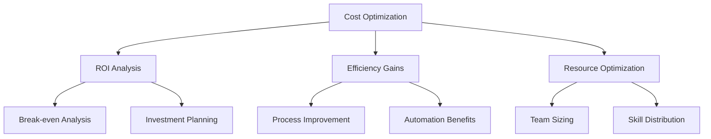

## 2. System Architecture

### 2.1 High-Level Overview

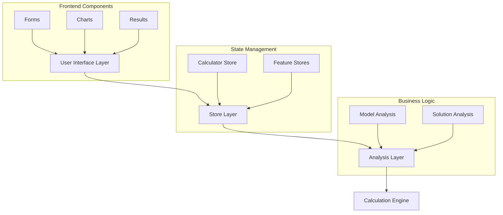

### 2.2 Component Architecture

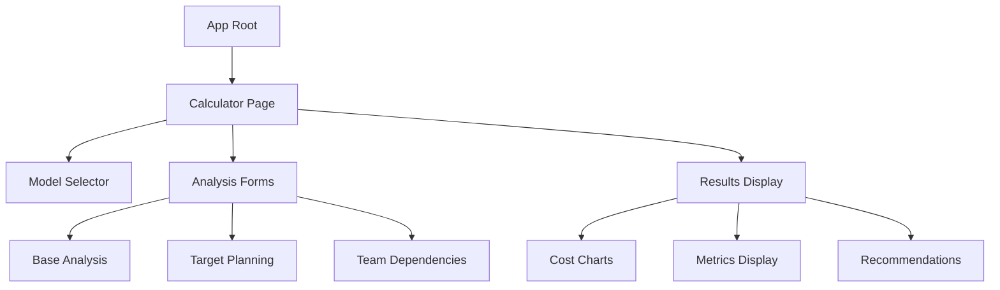

### 2.3 Data Flow

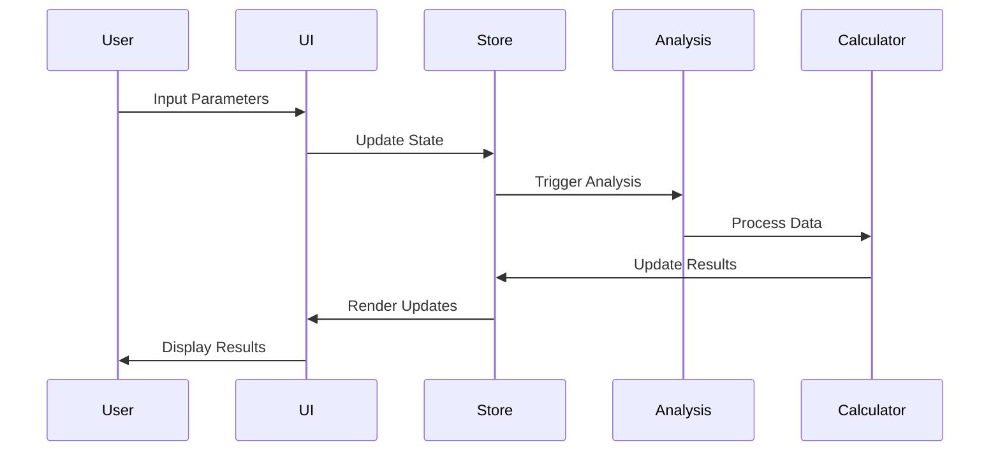

## 3. Model Analysis

### 3.1 Model Comparison

| Aspect | Team-Based Model | Ticket-Based Model |
|--------|-----------------|-------------------|
| Primary Focus | Resource Optimization | Volume Management |
| Cost Basis | Team Capacity | Transaction Volume |
| Optimization Target | Team Efficiency | Process Efficiency |
| Key Metrics | Team Size, Utilization | Ticket Volume, Processing Time |
| Scaling Factor | Linear with team size | Variable with volume |
| Risk Profile | Higher fixed costs | Volume-dependent costs |
| Flexibility | Lower, team-bound | Higher, volume-based |
| Quality Control | Team-driven | Process-driven |

### 3.2 Decision Framework

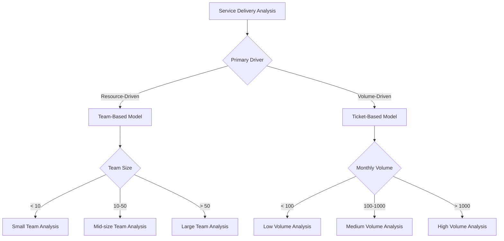

## 4. Team-Based Model

### 4.1 Base Analysis

#### Core Metrics

| Metric | Formula | Description | Optimization Goal |
|--------|---------|-------------|------------------|
| Base Monthly Cost | `TeamSize × HourlyRate × WorkingHours × Efficiency × (1 + Overhead)` | Total operational cost | Minimize while maintaining quality |
| Cost per Resource | `MonthlyCost ÷ TeamSize` | Individual resource cost | Optimize for skill level |
| Team Efficiency | `ProductiveHours ÷ TotalHours × 100` | Team productivity | Maximize within sustainable limits |
| Overhead Ratio | `OverheadCost ÷ DirectCost × 100` | Administrative burden | Minimize without compromising support |

#### Efficiency Calculations

```python
def calculate_team_efficiency(
    productive_hours: float,
    total_hours: float,
    quality_factor: float
) -> float:
    """
    Calculate team efficiency with quality adjustment
    
    Parameters:
    - productive_hours: Actual work hours
    - total_hours: Available work hours
    - quality_factor: Quality metric (0-1)
    
    Returns:
    - Adjusted efficiency score
    """
    base_efficiency = productive_hours / total_hours
    return base_efficiency * quality_factor
```

#### Cost Structure Analysis

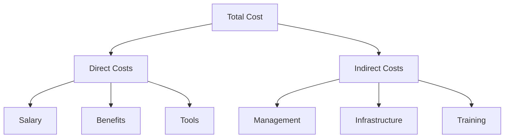

### 4.2 Solution Analysis

#### 4.2.1 Platform Solution

**Investment Analysis**
```python
def calculate_platform_roi(
    platform_cost: float,
    monthly_savings: float,
    time_period: int,
    discount_rate: float = 0.1
) -> float:
    """
    Calculate ROI for platform investment
    
    Parameters:
    - platform_cost: Initial investment
    - monthly_savings: Expected monthly savings
    - time_period: Analysis period in months
    - discount_rate: Annual discount rate
    
    Returns:
    - ROI as percentage
    """
    monthly_rate = discount_rate / 12
    npv_savings = sum(
        monthly_savings / (1 + monthly_rate)**t 
        for t in range(time_period)
    )
    return (npv_savings - platform_cost) / platform_cost * 100
```

**Efficiency Impact Matrix**

| Factor | Impact Range | Weight | Calculation |
|--------|-------------|--------|-------------|
| Automation Level | 0-90% | 0.4 | `AutomationLevel × Weight` |
| Process Standardization | 0-80% | 0.3 | `StandardizationLevel × Weight` |
| Error Reduction | 0-70% | 0.3 | `ErrorReduction × Weight` |

#### 4.2.2 Outsource Solution

**Cost Components**
```python
def calculate_outsource_cost(
    base_volume: float,
    vendor_rate: float,
    overhead_factor: float,
    quality_impact: float,
    knowledge_loss: float,
    transition_time: int
) -> float:
    """
    Calculate total outsourcing cost
    
    Parameters:
    - base_volume: Work volume in hours
    - vendor_rate: Hourly vendor rate
    - overhead_factor: Management overhead (1 + %)
    - quality_impact: Quality change (-1 to 1)
    - knowledge_loss: Knowledge degradation (0-1)
    - transition_time: Months for transition
    
    Returns:
    - Total monthly cost
    """
    base_cost = base_volume * vendor_rate * overhead_factor
    quality_factor = 1 + abs(quality_impact)
    knowledge_factor = 1 + (knowledge_loss * log10(transition_time + 1))
    return base_cost * quality_factor * knowledge_factor
```

**Risk Assessment Matrix**

| Risk Factor | Probability | Impact | Mitigation Strategy |
|-------------|------------|--------|-------------------|
| Quality Degradation | Medium | High | Quality SLAs, Monitoring |
| Knowledge Loss | High | Medium | Documentation, Training |
| Cost Escalation | Medium | High | Fixed-price Contracts |
| Dependency Risk | High | Medium | Vendor Diversification |

#### 4.2.3 Hybrid Solution

**Optimization Model**
```python
def optimize_hybrid_split(
    platform_costs: dict,
    outsource_costs: dict,
    constraints: dict
) -> tuple:
    """
    Optimize work distribution between platform and outsourcing
    
    Parameters:
    - platform_costs: Platform cost components
    - outsource_costs: Outsourcing cost components
    - constraints: Operational constraints
    
    Returns:
    - Optimal split (platform_portion, outsource_portion)
    """
    def total_cost(split: float) -> float:
        platform_portion = split
        outsource_portion = 1 - split
        
        platform_cost = calculate_platform_cost(
            platform_costs,
            platform_portion
        )
        outsource_cost = calculate_outsource_cost(
            outsource_costs,
            outsource_portion
        )
        
        return platform_cost + outsource_cost
    
    # Find minimum cost split using numerical optimization
    result = minimize_scalar(
        total_cost,
        bounds=(0, 1),
        method='bounded'
    )
    
    return (result.x, 1 - result.x)
```

**Integration Framework**

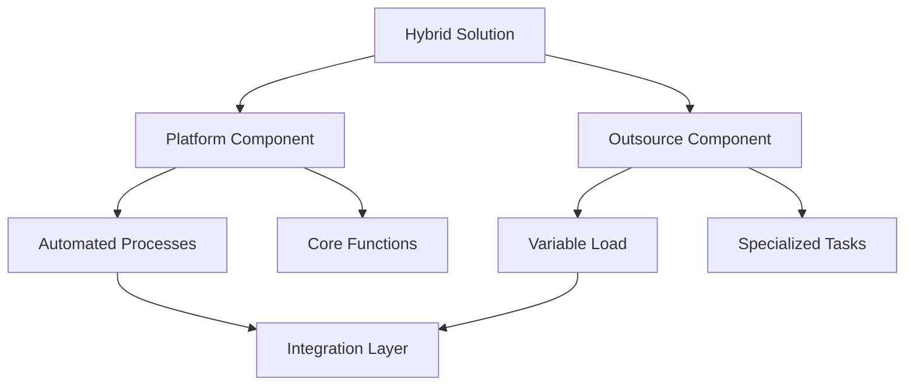

### 4.3 Target Planning

#### Strategic Planning Framework

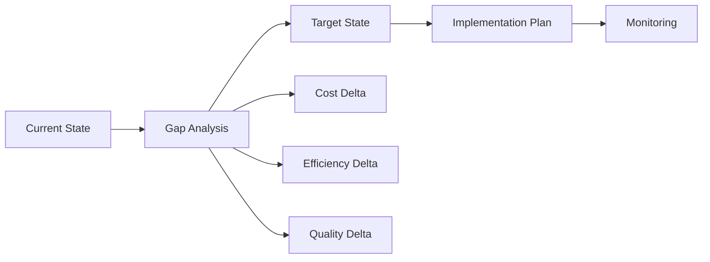

#### Target Setting Model

```python
def calculate_targets(
    current_metrics: dict,
    business_goals: dict,
    constraints: dict
) -> dict:
    """
    Calculate achievable targets based on constraints
    
    Parameters:
    - current_metrics: Current performance metrics
    - business_goals: Desired outcomes
    - constraints: Operational constraints
    
    Returns:
    - Dictionary of target metrics
    """
    targets = {}
    
    # Cost targets
    targets['cost'] = min(
        current_metrics['cost'] * (1 - business_goals['cost_reduction']),
        constraints['min_viable_cost']
    )
    
    # Efficiency targets
    targets['efficiency'] = min(
        current_metrics['efficiency'] * (1 + business_goals['efficiency_gain']),
        constraints['max_efficiency']
    )
    
    # Quality targets
    targets['quality'] = min(
        current_metrics['quality'] * (1 + business_goals['quality_improvement']),
        constraints['max_quality']
    )
    
    return targets
```

### 4.4 Team Dependencies

#### Dependency Analysis

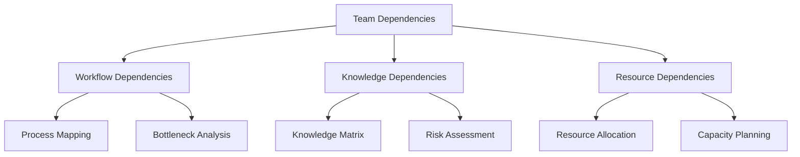

#### Impact Calculations

```python
def calculate_dependency_impact(
    dependencies: list,
    weights: dict,
    team_structure: dict
) -> dict:
    """
    Calculate impact of team dependencies
    
    Parameters:
    - dependencies: List of dependency objects
    - weights: Impact weights for different factors
    - team_structure: Team organization data
    
    Returns:
    - Dictionary of impact metrics
    """
    impacts = {
        'workflow': 0,
        'knowledge': 0,
        'resource': 0
    }
    
    for dep in dependencies:
        # Workflow impact
        impacts['workflow'] += (
            dep.frequency * 
            dep.criticality * 
            weights['workflow']
        )
        
        # Knowledge impact
        impacts['knowledge'] += (
            dep.knowledge_risk * 
            dep.bus_factor * 
            weights['knowledge']
        )
        
        # Resource impact
        impacts['resource'] += (
            dep.utilization * 
            dep.contention * 
            weights['resource']
        )
    
    return impacts
```

## 5. Ticket-Based Model

### 5.1 Base Analysis

#### Volume Metrics

| Metric | Formula | Description | Optimization Goal |
|--------|---------|-------------|------------------|
| Processing Capacity | `ResourceHours × TicketsPerHour` | Maximum ticket throughput | Match with demand |
| Unit Cost | `TotalCost ÷ TicketVolume` | Cost per ticket | Minimize while maintaining quality |
| SLA Compliance | `OnTimeTickets ÷ TotalTickets × 100` | Service level performance | Maximize within cost constraints |
| Quality Rate | `(TotalTickets - Rework) ÷ TotalTickets × 100` | First-time resolution | Maximize |

#### Volume Analysis

```python
def analyze_volume_patterns(
    historical_data: pd.DataFrame,
    forecast_period: int
) -> dict:
    """
    Analyze ticket volume patterns and forecast
    
    Parameters:
    - historical_data: Past ticket volume data
    - forecast_period: Number of periods to forecast
    
    Returns:
    - Dictionary of volume metrics and forecasts
    """
    analysis = {}
    
    # Basic statistics
    analysis['mean_volume'] = historical_data['volume'].mean()
    analysis['std_volume'] = historical_data['volume'].std()
    analysis['peak_volume'] = historical_data['volume'].max()
    
    # Seasonality analysis
    decomposition = seasonal_decompose(
        historical_data['volume'],
        period=12
    )
    analysis['seasonality'] = decomposition.seasonal.tolist()
    
    # Forecast
    model = SARIMA(historical_data['volume'])
    forecast = model.forecast(forecast_period)
    analysis['forecast'] = forecast.tolist()
    
    return analysis
```

### 5.2 Solution Analysis

#### 5.2.1 Platform Solution

**Automation Analysis**
```python
def analyze_automation_potential(
    ticket_data: pd.DataFrame,
    complexity_threshold: float = 0.7
) -> dict:
    """
    Analyze tickets for automation potential
    
    Parameters:
    - ticket_data: Historical ticket data
    - complexity_threshold: Maximum complexity for automation
    
    Returns:
    - Dictionary of automation metrics
    """
    analysis = {
        'automatable': 0,
        'partial_automation': 0,
        'manual_only': 0,
        'complexity_scores': [],
        'roi_estimates': []
    }
    
    for ticket in ticket_data.itertuples():
        complexity_score = calculate_complexity(ticket)
        if complexity_score < complexity_threshold:
            analysis['automatable'] += 1
        elif complexity_score < 0.85:
            analysis['partial_automation'] += 1
        else:
            analysis['manual_only'] += 1
            
        analysis['complexity_scores'].append(complexity_score)
        analysis['roi_estimates'].append(
            estimate_automation_roi(ticket, complexity_score)
        )
    
    return analysis
```

**Cost Modeling**
```python
def model_platform_costs(
    volume_data: dict,
    automation_analysis: dict,
    platform_params: dict
) -> dict:
    """
    Model platform solution costs
    
    Parameters:
    - volume_data: Ticket volume metrics
    - automation_analysis: Automation potential analysis
    - platform_params: Platform configuration parameters
    
    Returns:
    - Dictionary of cost projections
    """
    costs = {
        'implementation': {
            'platform': platform_params['base_cost'],
            'integration': platform_params['integration_cost'],
            'training': platform_params['training_cost']
        },
        'operational': {
            'maintenance': platform_params['monthly_maintenance'],
            'support': calculate_support_cost(volume_data),
            'licensing': platform_params['monthly_license']
        }
    }
    
    # Calculate automation savings
    automated_volume = volume_data['monthly_volume'] * (
        automation_analysis['automatable'] / 100
    )
    partial_volume = volume_data['monthly_volume'] * (
        automation_analysis['partial_automation'] / 100
    )
    
    costs['savings'] = {
        'full_automation': automated_volume * volume_data['cost_per_ticket'],
        'partial_automation': partial_volume * volume_data['cost_per_ticket'] * 0.5
    }
    
    return costs
```

#### 5.2.2 Outsource Solution

**Vendor Analysis**
```python
def analyze_vendor_capability(
    vendor_data: dict,
    requirements: dict
) -> float:
    """
    Calculate vendor capability score
    
    Parameters:
    - vendor_data: Vendor performance metrics
    - requirements: Service requirements
    
    Returns:
    - Capability score (0-1)
    """
    weights = {
        'sla_compliance': 0.3,
        'quality_score': 0.25,
        'cost_efficiency': 0.25,
        'scalability': 0.2
    }
    
    scores = {
        'sla_compliance': min(
            vendor_data['sla_compliance'] / requirements['min_sla'],
            1.0
        ),
        'quality_score': min(
            vendor_data['quality_score'] / requirements['min_quality'],
            1.0
        ),
        'cost_efficiency': min(
            requirements['max_cost'] / vendor_data['cost_per_ticket'],
            1.0
        ),
        'scalability': min(
            vendor_data['max_capacity'] / requirements['peak_volume'],
            1.0
        )
    }
    
    return sum(
        score * weights[metric]
        for metric, score in scores.items()
    )
```

**Volume-Based Pricing Model**
```python
def calculate_volume_pricing(
    base_rate: float,
    volume: int,
    tiers: list
) -> float:
    """
    Calculate volume-based pricing
    
    Parameters:
    - base_rate: Standard ticket rate
    - volume: Monthly ticket volume
    - tiers: Volume discount tiers
    
    Returns:
    - Adjusted per-ticket rate
    """
    for tier in tiers:
        if volume >= tier['min_volume']:
            return base_rate * (1 - tier['discount'])
    return base_rate
```

#### 5.2.3 Hybrid Solution

**Workload Distribution**
```python
def optimize_workload_distribution(
    ticket_data: pd.DataFrame,
    platform_capacity: dict,
    vendor_capacity: dict,
    constraints: dict
) -> dict:
    """
    Optimize workload distribution across platform and vendor
    
    Parameters:
    - ticket_data: Historical ticket data
    - platform_capacity: Platform capabilities
    - vendor_capacity: Vendor capabilities
    - constraints: Operational constraints
    
    Returns:
    - Optimal distribution plan
    """
    distribution = {
        'platform': {
            'volume': 0,
            'cost': 0,
            'types': set()
        },
        'vendor': {
            'volume': 0,
            'cost': 0,
            'types': set()
        },
        'internal': {
            'volume': 0,
            'cost': 0,
            'types': set()
        }
    }
    
    for ticket in ticket_data.itertuples():
        assignment = determine_optimal_handler(
            ticket,
            platform_capacity,
            vendor_capacity,
            constraints
        )
        
        distribution[assignment]['volume'] += 1
        distribution[assignment]['cost'] += calculate_handling_cost(
            ticket,
            assignment
        )
        distribution[assignment]['types'].add(ticket.type)
    
    return distribution
```

### 5.3 Target Planning

#### Capacity Planning
```python
def plan_capacity(
    forecast: pd.Series,
    current_capacity: dict,
    sla_requirements: dict
) -> dict:
    """
    Plan capacity based on volume forecast
    
    Parameters:
    - forecast: Volume forecast
    - current_capacity: Current processing capacity
    - sla_requirements: Service level requirements
    
    Returns:
    - Capacity requirements
    """
    requirements = {
        'base_capacity': 0,
        'peak_capacity': 0,
        'buffer_capacity': 0
    }
    
    # Base capacity for average volume
    requirements['base_capacity'] = calculate_required_capacity(
        forecast.mean(),
        sla_requirements['processing_time']
    )
    
    # Peak capacity for high volume periods
    requirements['peak_capacity'] = calculate_required_capacity(
        forecast.quantile(0.95),
        sla_requirements['processing_time']
    )
    
    # Buffer capacity for unexpected spikes
    requirements['buffer_capacity'] = requirements['peak_capacity'] * 0.2
    
    return requirements
```

#### Quality Management
```python
def define_quality_targets(
    current_metrics: dict,
    business_goals: dict
) -> dict:
    """
    Define quality targets based on business goals
    
    Parameters:
    - current_metrics: Current quality metrics
    - business_goals: Business objectives
    
    Returns:
    - Quality targets
    """
    targets = {}
    
    # First Contact Resolution
    targets['fcr'] = min(
        current_metrics['fcr'] * (1 + business_goals['quality_improvement']),
        0.95
    )
    
    # Customer Satisfaction
    targets['csat'] = min(
        current_metrics['csat'] * (1 + business_goals['satisfaction_improvement']),
        0.95
    )
    
    # Average Handle Time
    targets['aht'] = current_metrics['aht'] * (
        1 - business_goals['efficiency_improvement']
    )
    
    return targets
```

## 6. Implementation Guide

### 6.1 Technical Stack

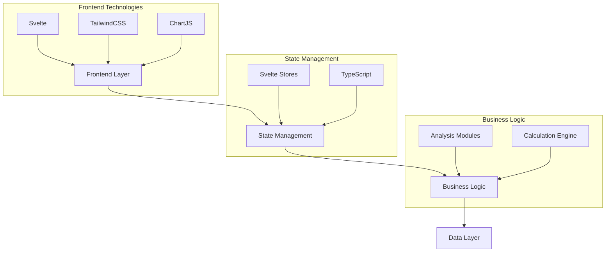

### 6.2 Store Architecture

```typescript
// Core Types
interface BaseAnalysisStore {
    model: ModelType;
    inputs: ModelInputs;
    results: AnalysisResults;
    status: CalculationStatus;
}

interface TargetPlanningStore {
    targets: PlanningTargets;
    scenarios: Scenario[];
    recommendations: Recommendation[];
}

interface TeamDependencyStore {
    dependencies: Dependency[];
    impacts: ImpactAssessment;
    optimizations: Optimization[];
}

// Store Implementation
class CalculatorStore {
    private baseStore: Writable<BaseAnalysisStore>;
    private targetStore: Writable<TargetPlanningStore>;
    private dependencyStore: Writable<TeamDependencyStore>;
    
    constructor() {
        this.baseStore = writable(initialBaseState);
        this.targetStore = writable(initialTargetState);
        this.dependencyStore = writable(initialDependencyState);
    }
    
    // Store methods...
}
```

### 6.3 Component Structure

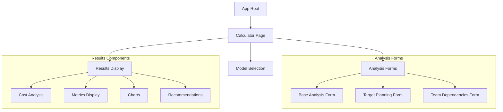

#### Component Lifecycle

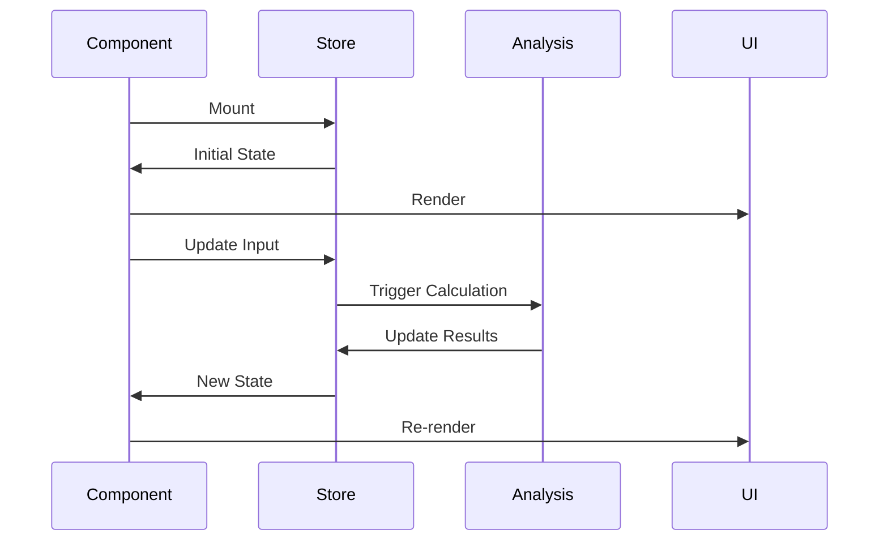