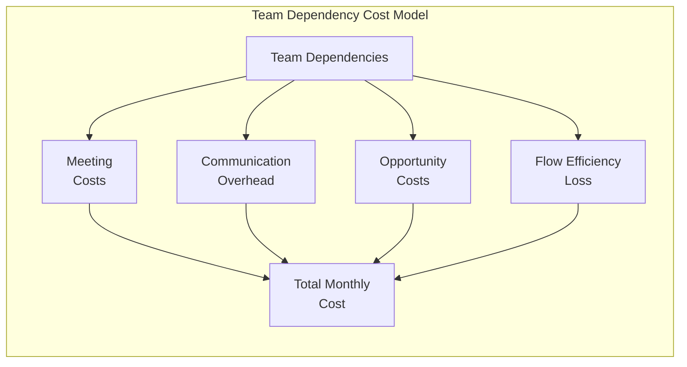
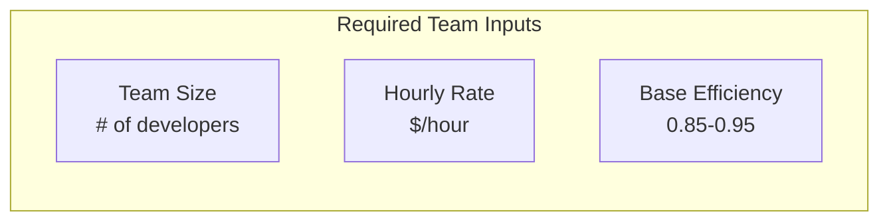
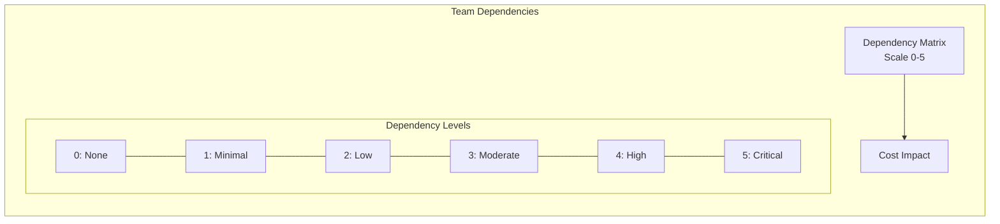
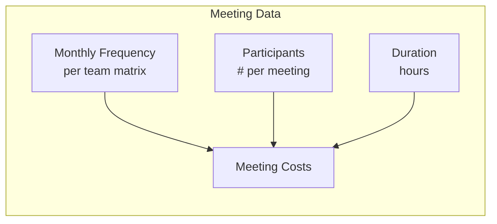
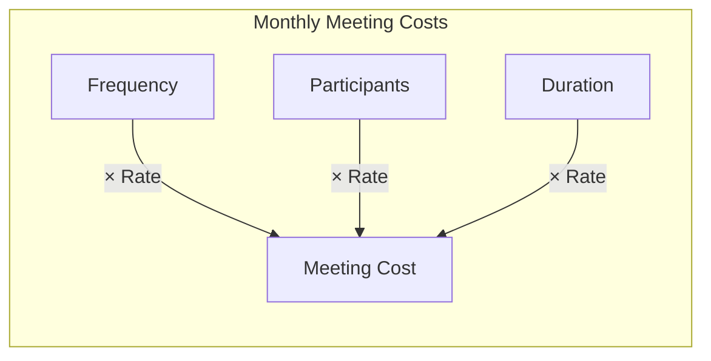
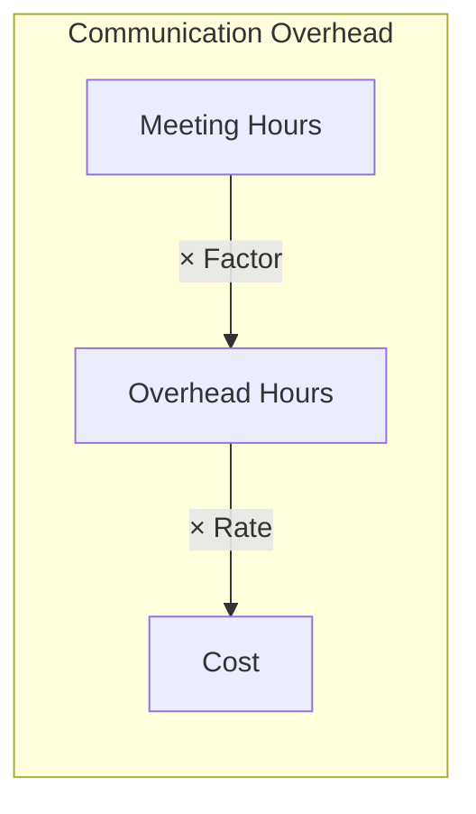
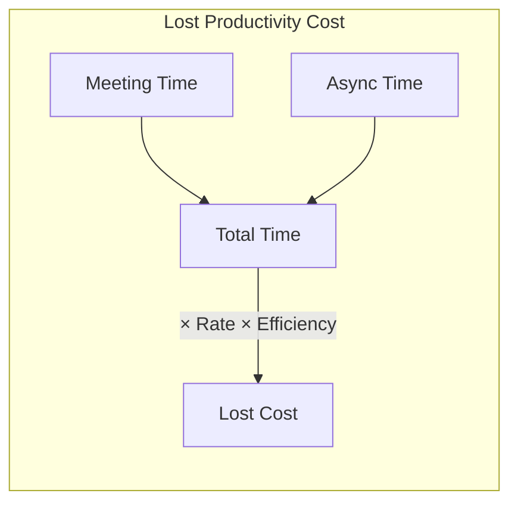
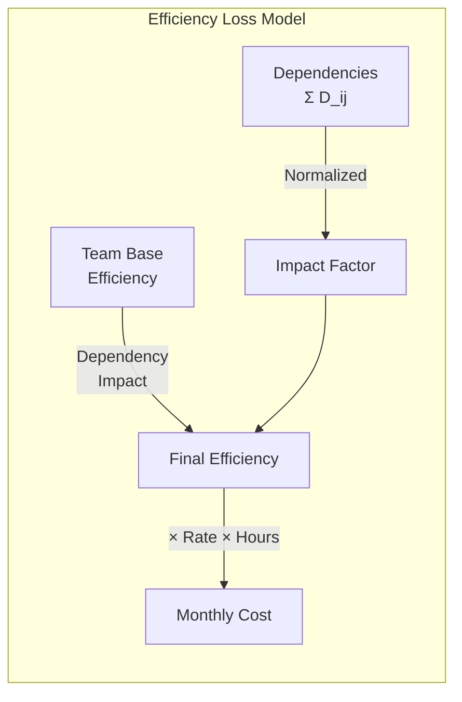
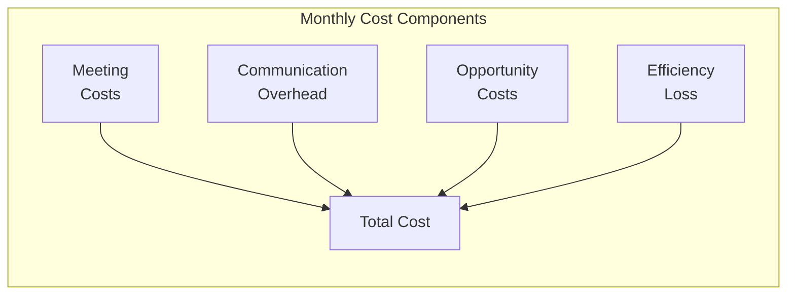

# Team Dependency Cost Impact Model

## 1. Problem Definition



## 2. Input Parameters

### 2.1 Team Parameters


Base Efficiency represents how effectively a team works on their tasks when there are no dependencies. Even in ideal conditions:
- Teams don't work at 100% capacity
- Some time is spent on internal coordination
- Context switching between tasks is inevitable
- Regular breaks and non-project activities are necessary

Typical values range from 0.85-0.95, meaning teams effectively use 85-95% of their theoretical maximum capacity. This base efficiency is then further reduced by dependencies between teams.

Example:
- Team of 5 developers
- 160 hours/month each = 800 total hours
- Base efficiency 0.9
- Actual working capacity = 720 hours/month before dependency impacts

### 2.2 Dependency Matrix


### 2.3 Meeting Parameters


## 3. Cost Components

### 3.1 Direct Meeting Costs


Formula:
```
Meeting_Cost[i,j] = Frequency × Participants × Hours × Rate
Total_Meeting_Cost = Σ Meeting_Cost[i,j]
```

### 3.2 Communication Overhead


Formula:
```
Overhead_Cost = Total_Meeting_Hours × Overhead_Factor × Rate
```


### 3.3 Opportunity Costs


Formula:
```
Lost_Hours = Meeting_Time + Async_Time
Opportunity_Cost = Lost_Hours × Dev_Rate × Base_Efficiency
```

Example:
- 60 total hours lost/month (20 meeting + 40 async)
- $100/hour rate
- 0.9 base efficiency
- Cost = 60 × $100 × 0.9 = $5,400/month

### 3.4 Flow Efficiency Impact



Formula:
```
Impact_Factor = 1 - (1 / (1 + e^((Σ Dependencies - 15)/10)))  // Sigmoid function
Final_Efficiency = Team_Base_Efficiency × (1 - Impact_Factor)
Efficiency_Loss = Team_Base_Efficiency - Final_Efficiency
Cost = Efficiency_Loss × Monthly_Hours × Rate
```

The new normalization uses a sigmoid function which:
1. Creates a more gradual impact curve
2. Has natural minimsum (0) and maximum (~0.5) impacts
3. Centers around typical dependency sums (10-20)
4. Reduces extreme impacts for high dependencies

### 3.5 Total Monthly Cost



Formula:
```
Total_Monthly_Cost = Meeting_Costs +
                     Communication_Overhead +
                     Opportunity_Costs +
                     Efficiency_Loss_Costs
```

Key Points:
1. All costs based on measurable inputs (hours, rates)
2. Dependencies affect multiple cost components
3. Higher dependency levels increase all cost types
4. Model can be calibrated using actual team data

