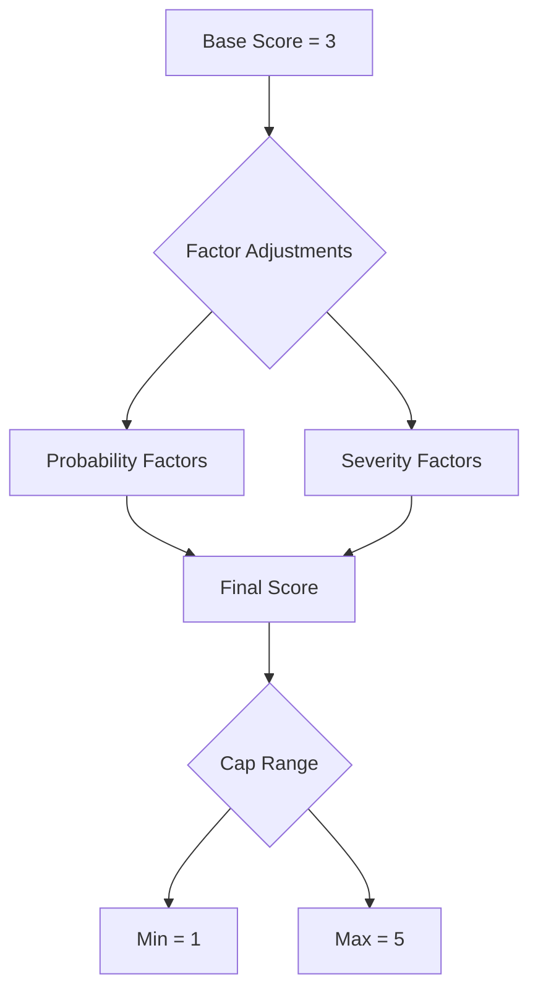

# Risk Matrix Mapping Logic

## Overview
This document outlines the methodology for calculating risk assessments in the Build vs Buy analysis. It explains how questionnaire answers influence risk probabilities and severities, providing a systematic approach to risk evaluation.

## Questionnaire Structure

### Section 1: Define Your Need

| Question | Options | Description |
|----------|---------|-------------|
| Solution Type | Platform | End-to-end system that integrates multiple components |
| | Application | Single-purpose software with a user interface |
| | Component | Specific functionality or service (API/library) |

### Section 2: Business Impact & Timeline

| Question | Options | Description |
|----------|---------|-------------|
| Business Role | Critical | Core business function, direct revenue impact |
| | Enabling | Supports core functions |
| | Supporting | Nice to have, internal support |
| Timeline Needed | 0-3 months | Immediate need |
| | 3-6 months | Short term |
| | 6-12 months | Medium term |
| | 12-24 months | Long term |
| Usage Duration | &lt;1 year | Temporary solution |
| | 1-3 years | Short term |
| | 3-5 years | Medium term |
| | &gt;5 years | Long term |

### Section 3: Market Maturity

| Question | Options | Description |
|----------|---------|-------------|
| Alternative Solutions | None | No alternatives available |
| | 1-3 | Limited options |
| | 4-10 | Good selection |
| | &gt;10 | Many options |
| Market Evolution | Fast | New options/standards emerge regularly |
| | Moderate | Occasional updates and new entrants |
| | Slow | Market is mature and stable |
| Market Standardization | High | Widely adopted standards exist |
| | Moderate | Some standards, but variations remain |
| | Low | Fragmented with little standardization |
| Alternative Types | Open Source | Community-driven solutions |
| | Commercial | Vendor-provided solutions |

### Section 4: Build Capability

| Question | Options | Description |
|----------|---------|-------------|
| Team Competency | Full | Complete expertise available |
| | Partial | Some expertise, needs upskilling |
| | None | No relevant expertise |
| Control Needed | Full | Extensive customization required |
| | Partial | Minor customization needed |
| | None | Standard functionality sufficient |
| Build FTEs | 1-2 | Small team |
| | 3-5 | Medium team |
| | &gt;5 | Large team |

### Section 5: Strategic Assessment

| Question | Options | Description |
|----------|---------|-------------|
| Strategic Alignment | Core | Central to strategy |
| | Necessary | Required for operations |
| | Nice | Enhances capabilities |
| | Cost | Pure cost reduction |
| Alternative Fitness | High | Minimal changes needed |
| | Moderate | Some customization needed |
| | Low | Significant adaptation required |

## Scoring Methodology

### Base Principles



### Score Interpretation

| Score | Probability | Severity |
|-------|------------|-----------|
| 1 | Very Unlikely | Minimal Impact |
| 2 | Unlikely | Minor Impact |
| 3 | Possible | Moderate Impact |
| 4 | Likely | Major Impact |
| 5 | Very Likely | Critical Impact |

### Factor Application Process


## Risk Analysis

### Build Risks

#### 1. Delivery Delays
**Description**: Risk of project timeline overruns and scope delays.

**Reasoning**: 
- Team capability directly impacts delivery speed and quality
- Shorter timelines leave less room for recovery from delays
- Complex solutions (platforms) have more potential delay points
- Business criticality affects impact of delays

| Factor Type | Question | Impact | Reasoning |
|-------------|----------|---------|-----------|
| Probability | Team Competency | Full (-1), Partial (0), None (+1) | Expertise reduces likelihood of technical delays |
| | Timeline Needed | 0-3m (+2), 3-6m (+1), 6-12m (0), 12-24m (-1) | Shorter timelines increase pressure and risk |
| | Solution Type | Platform (+1), Application (0), Component (-1) | More complex solutions have more potential delay points |
| Severity | Business Role | Critical (+2), Enabling (+1), Supporting (0) | Critical functions have higher business impact |
| | Timeline Needed | 0-3m (+1), Others (0) | Immediate needs have higher impact if delayed |

**Calculation Example**:
```typescript
// Example: Partial team, 3-month timeline, platform solution, critical role
const probability = 3 + 0 + 2 + 1 = 6 → 5 (capped)
const severity = 3 + 2 + 1 = 6 → 5 (capped)
```

#### 2. Technical Debt
**Description**: Risk of accumulated technical complexity and maintenance burden.

**Reasoning**:
- Team expertise affects code quality and architecture decisions
- Fast-evolving markets require frequent updates, increasing debt
- Longer usage duration amplifies impact of poor decisions
- Complex solutions accumulate more technical debt

| Factor Type | Question | Impact | Reasoning |
|-------------|----------|---------|-----------|
| Probability | Team Competency | Full (-2), Partial (0), None (+2) | Expertise crucial for maintainable code |
| | Market Evolution | Fast (+2), Moderate (+1), Slow (0) | Rapid changes force quick solutions |
| | Solution Type | Platform (+1), Application (0), Component (-1) | Complexity correlates with debt potential |
| Severity | Usage Duration | >5y (+2), 3-5y (+1), 1-3y (0), <1y (-1) | Longer usage amplifies debt impact |
| | Business Role | Critical (+1), Enabling (0), Supporting (-1) | Critical systems need higher quality |

**Calculation Example**:
```typescript
// Example: Partial team, fast market, platform, 5+ years, critical role
const probability = 3 + 0 + 2 + 1 = 6 → 5 (capped)
const severity = 3 + 2 + 1 = 6 → 5 (capped)
```

#### 3. Resource Dependencies
**Description**: Risk of key personnel reliance and knowledge concentration.

**Reasoning**:
- Smaller teams create single points of failure
- Expertise level affects knowledge distribution
- Complex solutions require more specialized knowledge
- Critical systems need more reliable staffing

| Factor Type | Question | Impact | Reasoning |
|-------------|----------|---------|-----------|
| Probability | Team Competency | Full (-1), Partial (+1), None (+2) | Limited expertise creates dependencies |
| | Build FTEs | 1-2 (+2), 3-5 (+1), >5 (0) | Smaller teams increase concentration risk |
| | Solution Type | Platform (+1), Application (0), Component (-1) | Complex solutions need more specialists |
| Severity | Business Role | Critical (+2), Enabling (+1), Supporting (0) | Critical functions need reliable staffing |
| | Control Needed | Full (+1), Partial (0), None (-1) | High control needs require more expertise |

**Calculation Example**:
```typescript
// Example: Partial team, 2 FTEs, platform, critical role, full control
const probability = 3 + 1 + 2 + 1 = 7 → 5 (capped)
const severity = 3 + 2 + 1 = 6 → 5 (capped)
```

#### 4. Feature Scope Creep
**Description**: Risk of expanding requirements and feature additions.

**Reasoning**:
- Fast-evolving markets drive feature demands
- Control requirements affect change flexibility
- Complex solutions invite more additions
- Business criticality influences change pressure

| Factor Type | Question | Impact | Reasoning |
|-------------|----------|---------|-----------|
| Probability | Market Evolution | Fast (+2), Moderate (+1), Slow (0) | Market speed drives change requests |
| | Control Needed | Full (+1), Partial (0), None (-1) | Control needs affect change frequency |
| | Solution Type | Platform (+1), Application (0), Component (-1) | Complex solutions attract more changes |
| Severity | Business Role | Critical (+1), Enabling (0), Supporting (-1) | Critical systems face more pressure |
| | Timeline Needed | 0-3m/3-6m (+1), Others (0) | Short timelines amplify impact |

**Calculation Example**:
```typescript
// Example: Fast market, full control, platform, critical role, short timeline
const probability = 3 + 2 + 1 + 1 = 7 → 5 (capped)
const severity = 3 + 1 + 1 = 5
```

#### 5. Maintenance Burden
**Description**: Risk of ongoing maintenance effort, updates, and fixes required to keep the solution operational and relevant.

**Reasoning**:
- Fast-evolving markets require more frequent updates
- Team expertise affects maintenance efficiency
- Complex solutions have more components to maintain
- Long-term usage increases maintenance importance
- Business criticality determines acceptable downtime

| Factor Type | Question | Impact | Reasoning |
|-------------|----------|---------|-----------|
| Probability | Market Evolution | Fast (+2), Moderate (+1), Slow (0) | Market pace drives update frequency |
| | Team Competency | Full (-1), Partial (0), None (+1) | Expertise affects maintenance efficiency |
| | Solution Type | Platform (+1), Application (0), Component (0) | Complex systems need more maintenance |
| Severity | Usage Duration | >5y (+2), 3-5y (+1), 1-3y (0), <1y (-1) | Longer usage increases maintenance impact |
| | Business Role | Critical (+1), Enabling (0), Supporting (-1) | Critical systems need faster fixes |

**Calculation Example**:
```typescript
// Example: Fast market, partial team, platform, 5+ years usage, critical role
const probability = 3 + 2 + 0 + 1 = 6 → 5 (capped)
const severity = 3 + 2 + 1 = 6 → 5 (capped)
```

#### 6. Integration Complexity
**Description**: Risk of difficulties in connecting with other systems, APIs, and data sources.

**Reasoning**:
- Platform solutions have more integration points
- Market standardization affects integration ease
- Team expertise impacts integration capability
- Critical systems often need more integrations
- Control requirements affect integration flexibility

| Factor Type | Question | Impact | Reasoning |
|-------------|----------|---------|-----------|
| Probability | Solution Type | Platform (+2), Application (+1), Component (0) | More components mean more integrations |
| | Market Standardization | Low (+1), Moderate (0), High (-1) | Standards simplify integration |
| | Team Competency | Full (-1), Partial (0), None (+1) | Expertise reduces integration challenges |
| Severity | Business Role | Critical (+2), Enabling (+1), Supporting (0) | Critical functions need reliable integration |
| | Control Needed | Full (+1), Partial (0), None (-1) | Control requirements affect integration complexity |

**Calculation Example**:
```typescript
// Example: Platform, low standardization, partial team, critical role, full control
const probability = 3 + 2 + 1 + 0 = 6 → 5 (capped)
const severity = 3 + 2 + 1 = 6 → 5 (capped)
```

#### 7. Knowledge Gaps
**Description**: Risk of missing crucial domain expertise or technical knowledge required for successful implementation.

**Reasoning**:
- Team competency directly impacts knowledge risk
- Market standardization affects knowledge availability
- Complex solutions require more diverse knowledge
- Critical systems need deeper understanding
- Fast markets require constant learning

| Factor Type | Question | Impact | Reasoning |
|-------------|----------|---------|-----------|
| Probability | Team Competency | Full (-2), Partial (+1), None (+2) | Direct measure of knowledge gaps |
| | Market Standardization | Low (+1), Moderate (0), High (-1) | Standard solutions are better documented |
| | Market Evolution | Fast (+1), Moderate (0), Slow (-1) | Fast evolution requires constant learning |
| Severity | Business Role | Critical (+2), Enabling (+1), Supporting (0) | Critical systems need deeper knowledge |
| | Solution Type | Platform (+1), Application (0), Component (0) | Complex solutions need broader expertise |

**Calculation Example**:
```typescript
// Example: Partial team, low standardization, fast market, critical role, platform
const probability = 3 + 1 + 1 + 1 = 6 → 5 (capped)
const severity = 3 + 2 + 1 = 6 → 5 (capped)
```

#### 8. Security Vulnerabilities
**Description**: Risk of security implementation issues and potential vulnerabilities in the solution.

**Reasoning**:
- Team expertise crucial for security implementation
- Market standardization provides security patterns
- Critical systems are more attractive targets
- Complex solutions have larger attack surface
- Security issues have lasting impact

| Factor Type | Question | Impact | Reasoning |
|-------------|----------|---------|-----------|
| Probability | Team Competency | Full (-2), Partial (0), None (+2) | Security expertise is crucial |
| | Market Standardization | Low (+1), Moderate (0), High (-1) | Standards include security patterns |
| | Solution Type | Platform (+1), Application (+1), Component (0) | Larger attack surface increases risk |
| Severity | Business Role | Critical (+2), Enabling (+1), Supporting (0) | Critical systems are prime targets |
| | Usage Duration | >5y/3-5y (+1), Others (0) | Long-term exposure increases impact |

**Calculation Example**:
```typescript
// Example: Partial team, low standardization, platform, critical role, 5+ years
const probability = 3 + 0 + 1 + 1 = 5
const severity = 3 + 2 + 1 = 6 → 5 (capped)
```

#### 9. Opportunity Cost
**Description**: Risk of tying up valuable resources that could be used for other strategic initiatives.

**Reasoning**:
- Larger teams have higher opportunity cost
- Short timelines increase resource pressure
- Critical projects justify resource allocation
- Strategic alignment affects resource priority
- Complex solutions need more resources

| Factor Type | Question | Impact | Reasoning |
|-------------|----------|---------|-----------|
| Probability | Build FTEs | >5 (+2), 3-5 (+1), 1-2 (0) | More resources mean higher opportunity cost |
| | Timeline Needed | 0-3m/3-6m (+1), Others (0) | Short timelines increase resource pressure |
| | Solution Type | Platform (+1), Application (0), Component (0) | Complex solutions need more resources |
| Severity | Business Role | Critical (+2), Enabling (+1), Supporting (0) | Critical functions justify resource use |
| | Strategic Alignment | Core (+1), Necessary (0), Nice/Cost (-1) | Strategic importance affects priority |

**Calculation Example**:
```typescript
// Example: Large team (>5 FTEs), short timeline, platform, critical role, core alignment
const probability = 3 + 2 + 1 + 1 = 7 → 5 (capped)
const severity = 3 + 2 + 1 = 6 → 5 (capped)
```

#### 10. Testing Complexity
**Description**: Risk of difficulties in ensuring quality and reliability through testing.

**Reasoning**:
- Complex solutions need more testing
- Team expertise affects testing effectiveness
- Market standards provide testing patterns
- Critical systems need thorough testing
- Long usage requires robust test suites

| Factor Type | Question | Impact | Reasoning |
|-------------|----------|---------|-----------|
| Probability | Solution Type | Platform (+2), Application (+1), Component (0) | Complexity increases testing needs |
| | Team Competency | Full (-1), Partial (0), None (+1) | Expertise affects testing capability |
| | Market Standardization | Low (+1), Moderate (0), High (-1) | Standards include testing patterns |
| Severity | Business Role | Critical (+2), Enabling (+1), Supporting (0) | Critical systems need thorough testing |
| | Usage Duration | >5y/3-5y (+1), Others (0) | Long-term use needs robust testing |

**Calculation Example**:
```typescript
// Example: Platform, partial team, low standardization, critical role, 5+ years
const probability = 3 + 2 + 0 + 1 = 6 → 5 (capped)
const severity = 3 + 2 + 1 = 6 → 5 (capped)
```

## Buy Risks

### 1. Vendor Lock-in
**Description**: Risk of becoming overly dependent on a specific vendor's solution, making it difficult or costly to switch providers.

**Reasoning**:
- Low market standardization increases dependency
- Fewer alternatives increase switching difficulty
- Longer usage deepens vendor dependency
- Critical systems face higher switching costs
- Platform solutions create deeper integrations

| Factor Type | Question | Impact | Reasoning |
|-------------|----------|---------|-----------|
| Probability | Market Standardization | Low (+2), Moderate (+1), High (-1) | Standards reduce lock-in risk |
| | Alternative Solutions | None (+2), 1-3 (+1), 4-10 (0), >10 (-1) | More options reduce dependency |
| | Solution Type | Platform (+1), Application (0), Component (-1) | Platforms create deeper integrations |
| Severity | Usage Duration | >5y (+2), 3-5y (+1), 1-3y (0), <1y (-1) | Longer usage increases switching cost |
| | Business Role | Critical (+2), Enabling (+1), Supporting (0) | Critical systems face higher impact |

**Calculation Example**:
```typescript
// Example: Low standardization, few alternatives (1-3), platform, 5+ years usage, critical role
const probability = 3 + 2 + 1 + 1 = 7 → 5 (capped)
const severity = 3 + 2 + 2 = 7 → 5 (capped)
```

### 2. Limited Customization
**Description**: Risk of being constrained by the vendor's solution capabilities and inability to adapt to specific needs.

**Reasoning**:
- High control needs increase customization importance
- Poor alternative fitness indicates customization gaps
- Critical functions need precise functionality
- Strategic alignment affects customization importance
- Complex solutions need more adaptation

| Factor Type | Question | Impact | Reasoning |
|-------------|----------|---------|-----------|
| Probability | Control Needed | Full (+2), Partial (+1), None (-1) | Control requirements drive customization needs |
| | Alternative Fitness | Low (+2), Moderate (+1), High (-1) | Poor fit indicates customization gaps |
| | Solution Type | Platform (+1), Application (0), Component (0) | Complex solutions need more adaptation |
| Severity | Business Role | Critical (+2), Enabling (+1), Supporting (0) | Critical functions need precise functionality |
| | Strategic Alignment | Core (+1), Necessary (0), Nice/Cost (-1) | Strategic importance affects customization needs |

**Calculation Example**:
```typescript
// Example: Full control needed, low fitness, platform, critical role, core strategic alignment
const probability = 3 + 2 + 2 + 1 = 8 → 5 (capped)
const severity = 3 + 2 + 1 = 6 → 5 (capped)
```

### 3. Rising Costs
**Description**: Risk of unexpected price increases, hidden costs, and escalating expenses over time.

**Reasoning**:
- Fast market evolution drives price changes
- Limited alternatives allow price increases
- Long usage exposes to more price changes
- Critical systems have less negotiation power
- User count affects cost scaling

| Factor Type | Question | Impact | Reasoning |
|-------------|----------|---------|-----------|
| Probability | Market Evolution | Fast (+2), Moderate (+1), Slow (-1) | Market dynamics affect pricing stability |
| | Alternative Solutions | None (+2), 1-3 (+1), 4-10 (0), >10 (-1) | Competition controls price increases |
| | Usage Duration | >5y (+1), 3-5y (+1), Others (0) | Longer exposure to price changes |
| Severity | Business Role | Critical (+2), Enabling (+1), Supporting (0) | Critical systems face higher impact |
| | Strategic Alignment | Core (+1), Necessary (0), Nice/Cost (-1) | Strategic importance affects budget flexibility |

**Calculation Example**:
```typescript
// Example: Fast market, few alternatives (1-3), 5+ years usage, critical role, core alignment
const probability = 3 + 2 + 1 + 1 = 7 → 5 (capped)
const severity = 3 + 2 + 1 = 6 → 5 (capped)
```

### 4. Vendor Viability
**Description**: Risk of vendor instability, acquisition, or discontinuation of the solution.

**Reasoning**:
- Limited alternatives indicate market instability
- Fast evolution creates vendor uncertainty
- Critical systems need stable vendors
- Longer usage increases exposure
- Complex solutions have higher stakes

| Factor Type | Question | Impact | Reasoning |
|-------------|----------|---------|-----------|
| Probability | Alternative Solutions | None (+2), 1-3 (+1), 4-10 (0), >10 (-1) | Market maturity indicates stability |
| | Market Evolution | Fast (+2), Moderate (+1), Slow (-1) | Fast markets have more volatility |
| | Solution Type | Platform (+1), Application (0), Component (-1) | Complex solutions have higher stakes |
| Severity | Business Role | Critical (+2), Enabling (+1), Supporting (0) | Critical functions need stable vendors |
| | Usage Duration | >5y/3-5y (+1), Others (0) | Long-term commitment increases impact |

**Calculation Example**:
```typescript
// Example: Few alternatives (1-3), fast market, platform, critical role, 5+ years
const probability = 3 + 1 + 2 + 1 = 7 → 5 (capped)
const severity = 3 + 2 + 1 = 6 → 5 (capped)
```

### 5. Integration Limitations
**Description**: Risk of difficulties or restrictions in integrating with other systems and data sources.

**Reasoning**:
- Low standardization complicates integration
- Poor alternative fitness indicates integration challenges
- Complex solutions need more integrations
- Critical systems need reliable connections
- Control requirements affect integration flexibility

| Factor Type | Question | Impact | Reasoning |
|-------------|----------|---------|-----------|
| Probability | Market Standardization | Low (+2), Moderate (+1), High (-1) | Standards simplify integration |
| | Alternative Fitness | Low (+1), Moderate (0), High (-1) | Poor fit suggests integration issues |
| | Solution Type | Platform (+1), Application (+1), Component (0) | Complex solutions need more integration |
| Severity | Business Role | Critical (+2), Enabling (+1), Supporting (0) | Critical systems need reliable integration |
| | Control Needed | Full (+1), Partial (0), None (-1) | Control requirements affect flexibility |

**Calculation Example**:
```typescript
// Example: Low standardization, low fitness, platform, critical role, full control
const probability = 3 + 2 + 1 + 1 = 7 → 5 (capped)
const severity = 3 + 2 + 1 = 6 → 5 (capped)
```

### 6. Performance Issues
**Description**: Risk of inadequate performance, scalability limitations, or reliability problems with the vendor's solution.

**Reasoning**:
- Control limitations affect performance optimization
- Poor alternative fitness suggests performance gaps
- Critical systems have stricter performance needs
- Complex solutions have more performance points
- High user counts amplify performance issues

| Factor Type | Question | Impact | Reasoning |
|-------------|----------|---------|-----------|
| Probability | Control Needed | Full (+2), Partial (+1), None (-1) | Control affects optimization ability |
| | Alternative Fitness | Low (+2), Moderate (+1), High (-1) | Poor fit suggests performance gaps |
| | Solution Type | Platform (+1), Application (+1), Component (0) | Complexity affects performance points |
| Severity | Business Role | Critical (+2), Enabling (+1), Supporting (0) | Critical systems need high performance |
| | Usage Duration | >5y/3-5y (+1), Others (0) | Long-term impact of performance issues |

**Calculation Example**:
```typescript
// Example: Full control needed, low fitness, platform, critical role, 5+ years
const probability = 3 + 2 + 2 + 1 = 8 → 5 (capped)
const severity = 3 + 2 + 1 = 6 → 5 (capped)
```

### 7. Data Privacy Concerns
**Description**: Risk of inadequate data protection, compliance issues, or privacy breaches in vendor-managed solutions.

**Reasoning**:
- Market standards affect privacy practices
- Limited alternatives reduce privacy options
- Critical data needs stronger protection
- Platform solutions handle more data
- Long usage increases exposure risk

| Factor Type | Question | Impact | Reasoning |
|-------------|----------|---------|-----------|
| Probability | Market Standardization | Low (+2), Moderate (+1), High (-1) | Standards include privacy practices |
| | Alternative Solutions | None (+1), 1-3 (+1), Others (-1) | Options for privacy requirements |
| | Solution Type | Platform (+1), Application (+1), Component (0) | Data handling scope |
| Severity | Business Role | Critical (+2), Enabling (+1), Supporting (0) | Impact of privacy breaches |
| | Control Needed | Full (+1), Partial (0), None (-1) | Control over data handling |

**Calculation Example**:
```typescript
// Example: Low standardization, few alternatives, platform, critical role, full control
const probability = 3 + 2 + 1 + 1 = 7 → 5 (capped)
const severity = 3 + 2 + 1 = 6 → 5 (capped)
```

### 8. Feature Dependency
**Description**: Risk of relying on vendor's roadmap and feature development priorities.

**Reasoning**:
- Fast markets need quicker feature updates
- Limited alternatives increase dependency
- Control needs affect feature flexibility
- Critical functions need timely updates
- Strategic alignment affects priority

| Factor Type | Question | Impact | Reasoning |
|-------------|----------|---------|-----------|
| Probability | Market Evolution | Fast (+2), Moderate (+1), Slow (-1) | Market pace drives feature needs |
| | Alternative Solutions | None (+2), 1-3 (+1), 4-10 (0), >10 (-1) | Options for feature requirements |
| | Control Needed | Full (+1), Partial (0), None (-1) | Dependency on vendor features |
| Severity | Business Role | Critical (+2), Enabling (+1), Supporting (0) | Impact of missing features |
| | Strategic Alignment | Core (+1), Necessary (0), Nice/Cost (-1) | Strategic importance of features |

**Calculation Example**:
```typescript
// Example: Fast market, few alternatives, full control, critical role, core alignment
const probability = 3 + 2 + 1 + 1 = 7 → 5 (capped)
const severity = 3 + 2 + 1 = 6 → 5 (capped)
```

### 9. Support Quality
**Description**: Risk of inadequate vendor support, slow response times, or unresolved issues.

**Reasoning**:
- Limited alternatives affect support quality
- Market maturity influences support standards
- Critical systems need reliable support
- Complex solutions need more support
- Control needs affect support importance

| Factor Type | Question | Impact | Reasoning |
|-------------|----------|---------|-----------|
| Probability | Alternative Solutions | None (+2), 1-3 (+1), 4-10 (0), >10 (-1) | Competition drives support quality |
| | Market Standardization | Low (+1), Moderate (0), High (-1) | Standards for support levels |
| | Solution Type | Platform (+1), Application (+1), Component (0) | Support complexity |
| Severity | Business Role | Critical (+2), Enabling (+1), Supporting (0) | Impact of support issues |
| | Control Needed | Full (+1), Partial (0), None (-1) | Importance of vendor support |

**Calculation Example**:
```typescript
// Example: Few alternatives, low standardization, platform, critical role, full control
const probability = 3 + 1 + 1 + 1 = 6 → 5 (capped)
const severity = 3 + 2 + 1 = 6 → 5 (capped)
```

### 10. Migration Complexity
**Description**: Risk of difficulties in data migration, system transition, or vendor switching.

**Reasoning**:
- Market standards affect migration ease
- Poor alternative fitness complicates migration
- Complex solutions have more migration points
- Critical systems need smooth transitions
- Long usage accumulates more data

| Factor Type | Question | Impact | Reasoning |
|-------------|----------|---------|-----------|
| Probability | Market Standardization | Low (+2), Moderate (+1), High (-1) | Standards for data portability |
| | Alternative Fitness | Low (+1), Moderate (0), High (-1) | Migration compatibility |
| | Solution Type | Platform (+2), Application (+1), Component (0) | Migration complexity |
| Severity | Business Role | Critical (+2), Enabling (+1), Supporting (0) | Impact of migration issues |
| | Usage Duration | >5y/3-5y (+1), Others (0) | Data volume and complexity |

**Calculation Example**:
```typescript
// Example: Low standardization, low fitness, platform, critical role, 5+ years
const probability = 3 + 2 + 1 + 2 = 8 → 5 (capped)
const severity = 3 + 2 + 1 = 6 → 5 (capped)
```

